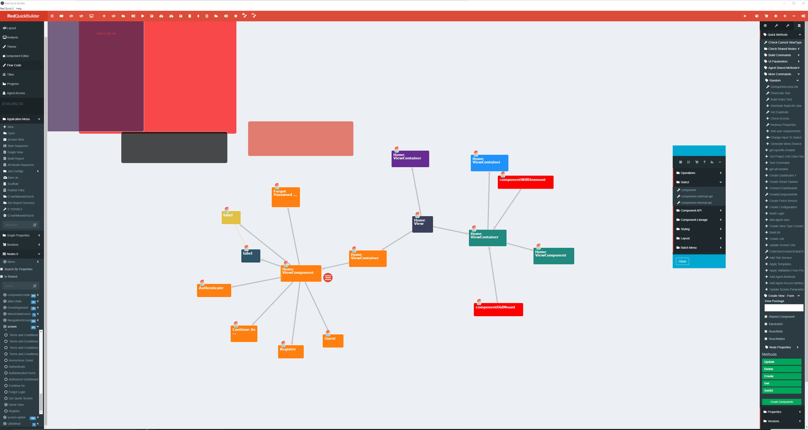
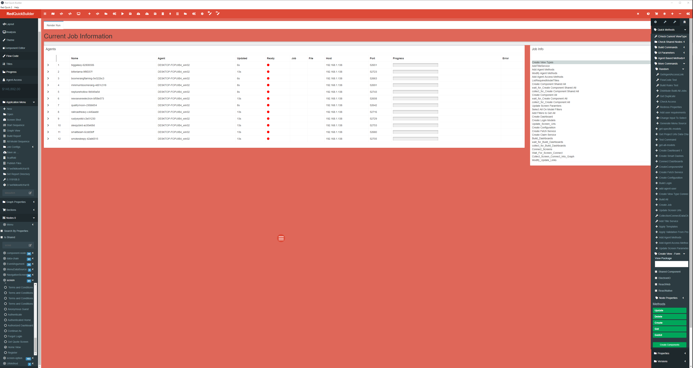
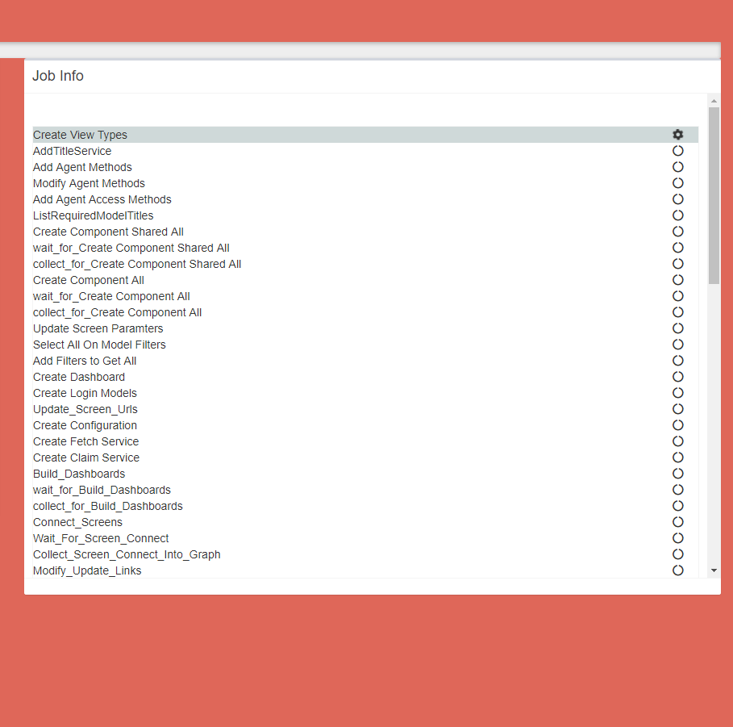
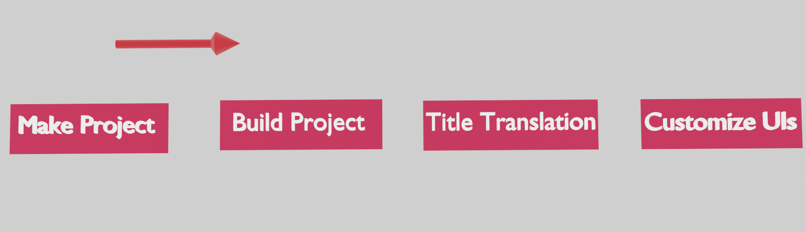
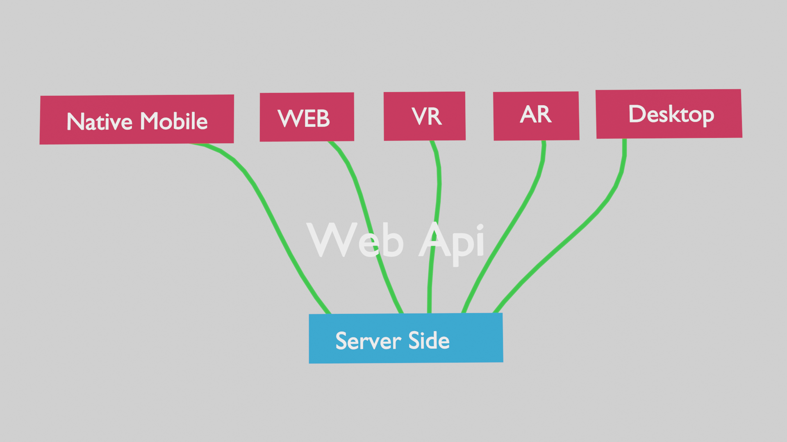
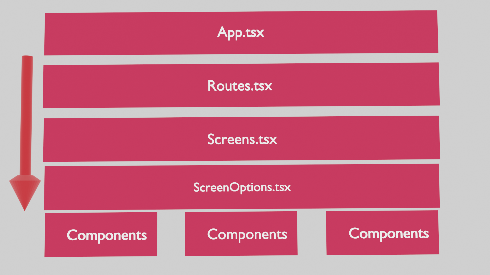
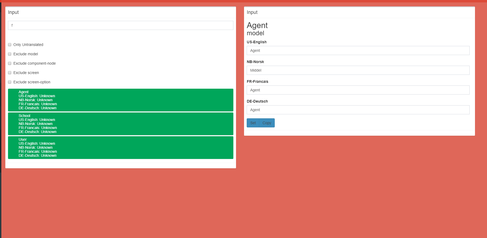

# RedQuickBuilder
## Quick Start
If I was you, I wouldn't actually try to use this thing, cause its tied together with hopes and dreams at the moment. But, If you want to play around with it for fun. Then have a go.

### Dev mode
    ```
    > yarn install
    > yarn dev
    or
    > yarn start
    ```
### Build release

    ```
    npm run package-win
    ```
    or
    ```
    npm run package-linux
    ```
    or
    ```
    npm run package-mac
    ```

## Intro
This project was supposed to take like 8 weeks. Apparently, I'm bad at estimating and good at fooling myself. So, this is an attempt at explaining everything that is related to RedQuickBuilder, warts and all.

### Who am I

Obligatory statement about who I am.
- Andrew Porter
- Software Engineer
- Minnesota (where i live)

### What am I doing
- I want to execute my "what if ideas" faster.
- I want to be able to execute other people's ideas faster
- I want to build complete solutions that can scale to millions of users.
    - Why not billions?
        - I can solve those problems later.
### State the solution

The solution is abnoxiously large, at least for 1 dev. 


### RedQuickBuilder



RedQuickBuilder is an application which can produce applications from a visual graph representation. It is capabable of producing apps for different devices. The intention is to be able to generate apps for all sorts of different UI situations. The purpose of RedQuickBuilder isn't for continuously developing applications, but to jump start the app building process. It would be cool to only develop applications in RedQuickBuilder, but that won't happen for a long while.

1. Web
1. Native Mobile
1. Desktop
1. VR (not yet realized)
1. AR (not yet realized)

Currently, the system has 3 main parts. Main UI, "Workers", and an "Organization process". The workers and the organization process themselves don't use a lot of resources, but when they are working through a project they will consume a tremendous amount of resources. 

Typically, when I am running locally I have 12 processes running, and a single organization process. I have seen it consume up to 75gb of ram, and utilize 80% of my processor resources. I have a very large machine, but have definitely had my other machines just crash because of resource consumption. The system is capable of distributing the work across multiple machines, but I haven't been able to resolve a reliability issue that keeps cropping up. And, I really haven't spent a lot of time trying either.

This is a view of the Process monitoring screen. It gives an overview of the currently running processes and the current stage in the process.



The job list displays which step is currently being executed, and where the process currently is. In the image below, there isn't a current job running.



The test applications that I have been working on have typically take around 4-6 hours to process all the way through, which is terribly long. But, I would estimate the amount of "me" time it would take to do it manually would be in the months range. So, from that perspective I'm calling it a win. I would also assume that since I've written the program in typescript, that isn't helping the speed at all. 

In a perfect world, these are the general steps of building an application in RedQuickBuilder.



- Make Project
    -   Building the project in the RedQuickBuilder UI.
- Build Project
    -   The multi threaded building of all the Screens and Components used in the various UIs and the back-end services.
- Title Translation
    - Translating all the words used in the site in to the various languages that you care about. Even though it only supports 4 at the moment. This obviously could expand, but I only know 4 well enough to know if I was waaaaaaaay wrong.
- Customize UI
    - Inside RedQuickBuilder, you will be able to organize and build your sites css.

#### Main UI
The main UI, as previously described, will be where almost all the user's time will be spent organizing and building the application. When the application is ready to be "printed", new jobs can be kicked off from here and monitored in the UI.

##### Starting the UI
```
> yarn start
or
> yarn dev
```

#### Worker Background Process
This is an independently running agent that will respond to sub tasks distributed by the "organization process".

##### Starting Worker Background Process
```
> npm run jwb
```

#### Organization Process
When new jobs are detected, this will distribute work tasks to available background processes to handle the work. The process also keeps track of the process to ensure that the subtasks distributed to the workers is merged back together, and the next step can proceed.

##### Starting Organization Process
```
> npm run jr
```

### Architecture
#### Output architecture

RedQuickBuilder's goal is to generate applications, but those applications are designed to be generated in a way that seems human written. So, names of screens, properties and variables, hopefully, will give the impression that a human being wrote most of the code, and was following the application's intentions.




So any future UI invented should be able to be plugged into the system and live next to the others.

#### Front End
##### Client Apps
The archictecture of all the client applications follows the same pattern, as illustrated below.



1. Web
    1. React
        1. The current iterations of web apps generated with React come with:
            1. redux
            1. redux-thunk
            1. typescript
            1. A lot more but the aforementioned are the most important.
        1. Architecture of the React app.
            1. App.tsx
            ```tsx
            import React, { Fragment } from 'react';
            // ... more imports

            let store = createStore(createRootReducer(history), applyMiddleware(thunk));

            const AppContainer = process.env.PLAIN_HMR ? Fragment : ReactHotAppContainer;

            render(
            <AppContainer>
                <Root store={store} history={history} />
            </AppContainer>,
            document.getElementById('root')
            );
            ```
            1. Root.tsx
            ```tsx
            const Root = ({ store, history }: Props) => (
                <Provider store={store}>
                    <ConnectedRouter history={history}>
                        <Routes />
                    </ConnectedRouter>
                </Provider>
            );

            ```
            1. Routes.tsx, is the first place where application code will appear. Application screens are setup of here with their routes, and will be lazy loaded by default. The RedQuickBuilder will be able to setup custom loading screens or they can be added later in the <Suspense /> section.
            ```tsx
            import React, { Suspense, lazy } from 'react';
            import { Switch, Route } from 'react-router';
            import routes from './constants/routes';
            import { ViewModelKeys } from './viewmodel_keys';
            import * as DC from './actions/data-chain';
            import App from './containers/App';
            import { setParameters } from './actions/redutils';
            import fetchservice from './util/fetchService';

            // Lazy load and import modules
            const AuthorizedDashboard = lazy(() => import('./screens/authorizedDashboard'));
            /* All the application specific loads would be here. */
            const AuthenticatedHome = lazy(() => import('./screens/authenticatedHome'));
            
            // Initializes some things for the service.
            fetchservice();

            export default () => (
            <App>
                <Suspense fallback={<div>Loading...</div>}>
                <Switch>
                /* 
                    All the routes would be here.
                */
                    <Route path={routes.HomeView} render={({ match, history, location }: any) => {
                        console.log(match.params);
                        let {} = match.params;
                        
                        setParameters({});
                        return <HomeView  />}} />
                    <Route path={routes.InsuranceProviderUpdateManagementAgent} render={({ match, history, location }: any) => {
                        console.log(match.params);
                        let {model,viewModel = ViewModelKeys.InsuranceProviderUpdateManagementAgent} = match.params;
                        viewModel = DC.insuranceProviderUpdateManagementAgent.GetInsuranceProviderUpdateManagementAgentviewmodel();
                        setParameters({model,viewModel});
                        return <InsuranceProviderUpdateManagementAgent model={model} viewModel={viewModel} />}} />
                /* 
                    All the routes would be here.
                */
                </Switch>
                </Suspense>
            </App>
            );

            ```
            1. setParameters
                1. In the example above setParameters are executed when navigated to the screen. The parameters are pulled from the url on navigation, and set so that components can grab them for use. Not every screen has a parameter, but they all will execute that function. The idea being that if you want to add them later manually, it should be really easy.
                1. You may notice that the viewModel is being pull from the *match.params*, but it is being immediately overridden by a function call. If we were writing this manually that wouldn't ever happen, but since this is being generated from a graph things like this happen. Since, it won't cause any known issues, its a low priority to fix at the moment. 
            1. viewModel
                1. In the context of a RedQuickBuilder generated app, it describes the context in which a screen lives. Screens that are for Creating or Updating models have *viewModel* that are used as keys to store the current forms state. If a model is being updated, the model is copied to a different store key to be manipulated separately. If the work is saved, it will send an update command to the server side, and assuming a successfuly update. Its updated version will be reloaded and placed into the part of the state storing all the models of its type.
            1. model
                1. Usually the id of the model that will be pulled from the server-side on load, to ensure that the latest possible version of the model is loaded.
            1. viewModel and model
                1. The two values are properties of most screens, if they exist, and will be passed down from the screen component to each of the child components.


            1. Screens
                1. Basic anatomy of a screen. The code generated will be very uniform so that customizing the UI beyond the existing it generated form is easy. The purpose of RedQuickBuilder isn't for continuously developing applications, but to jump start the app building process.
                ```tsx
                import * as React from 'react';
                import { redConnect } from '..`/actions/util';
                import * as DC from '../actions/data-chain';
                import Models from '../model_keys';
                import { setNavigate, LoadModel } from '../actions/uiActions';
                import { retrieveParameters } from '../actions/redutils';
                import { ViewModelKeys } from '../viewmodel_keys';
                import {
                Container} from '../html-components';
                import InsuranceProviderUpdateManagementAgentForm from '../components/insuranceProviderUpdateManagementAgentForm'
                // InsuranceProviderUpdateManagementAgent
                let navigationInstance: any;
                class InsuranceProviderUpdateManagementAgent extends React.Component<{ [index: string]: any }, { [index: string]: any }> {
                    constructor(props: any) {
                        super(props);

                        this.state = {};
                    }
                    componentDidUpdate(prevProps: any) {
                        this.captureValues();
                    }

                    captureValues() {
                        let updated = false;
                        let updates = {};

                        var new_model = this.props.model;
                        if (new_model !== this.state.model) {
                        updated = true;
                        updates = { ...updates, model: new_model };
                        }

                        var new_viewModel = this.props.viewModel;
                        if (new_viewModel !== this.state.viewModel) {
                        updated = true;
                        updates = { ...updates, viewModel: new_viewModel };
                        }
                        if (updated) {
                        this.setState(() => {
                            return updates;
                        }, () => {
                            // do stuff here;
                            if (updates.hasOwnProperty('model')) {
                            this.props.getInsuranceProviderbyManagementAgentForUpdate({
                                template: { model: this.state.model }, dataChain: (() => {
                                return LoadModel(ViewModelKeys.InsuranceProviderUpdateManagementAgent, Models.InsuranceProvider, retrieveParameters)
                                })
                            });
                            }
                        })
                        }
                    }
                    componentDidMount() {
                        DC.GoToLoginScreenWithNoCredentials({});
                        this.props.setGetState();
                        this.captureValues();
                    }
                    render() {
                        return (
                        <Container>
                            <InsuranceProviderUpdateManagementAgentForm
                            model={this.state.model}
                            viewModel={this.state.viewModel} />
                        </Container>
                        );
                    }
                }

                export default redConnect(InsuranceProviderUpdateManagementAgent);
                ```
                    1. captureValues
                        1. This function is executed on all update and mounting events in the React lifecycle. It takes the properties that we care about from the *props*, and puts them in the Screens state. If there are any changes it will execute the mounting function that was defined in the RedQuickBuilder AgentAccess Mounting tab. This is where the power of RedQuickBuilder shows up. As a developer calling a function is really easy, but getting that function to be wired up from the front end all the way to the backend takes quite a lot of effort and time. So, RedQuickBuilder does all that for you.
                    1. componentDidMount
                        1. This is a line that is optionally added to every screen in the RedQuickBuilder UI. It implements checking that the user has been logged into the UI, if not, it will return the user to the login screen.
                        ```tsx
                        DC.GoToLoginScreenWithNoCredentials({});
                        ```
                        1. setGetState is used to ensure that a reference exists to the getState and dispatch functions that will be available to *out of band* functions that occur. For example, when models are loaded that have references to other models. We can automatically load those models so that the UI can load the data, and display the content if desired.
                        ```tsx
                        this.props.setGetState()
                        ```
                    1. redConnect is a utility that adds functions and properties to the components *props*.
                        ```tsx
                        export default redConnect(InsuranceProviderUpdateManagementAgent);
                        ```
            1. Screen Options
                1. This is similar to Screens, but offer the opportunity to use business based components in composite screens later. There is a case to be made for, "you ain't gonna need it". Since, it costs just a bit of time to generate the code, you get the whole kitchen and the sink.
                ```tsx
                import * as React from 'react';
                import { redConnect, titleService } from '../actions/util';
                import {
                GetMenuDataSource} from '../actions/uiActions';
                import RedGraph from '../actions/redgraph';
                import {
                GetMenuSource
                } from '../actions/menuSource';
                import {
                Text, View} from '../html-components';

                import InsuranceProviderUpdateManagementAgentFormTitle from './insuranceProviderUpdateManagementAgentForm/insuranceProviderUpdateManagementAgentFormTitle'
                import InsuranceProviderUpdateManagementAgentFormMenu from './insuranceProviderUpdateManagementAgentForm/insuranceProviderUpdateManagementAgentFormMenu'
                import InsuranceProviderUpdate from './insuranceProviderUpdateManagementAgentForm/insuranceProviderUpdate'
                import './insuranceProviderUpdateManagementAgentForm.scss'
                // InsuranceProviderUpdateManagementAgentForm
                class InsuranceProviderUpdateManagementAgentForm extends React.Component<{ [index: string]: any }, { [index: string]: any }> {
                    constructor(props: any) {
                        super(props);

                        this.state = {
                            value: null,
                            viewModel: null
                        };
                    }
                    componentDidUpdate(prevProps: any) {
                        this.captureValues();
                    }
                    componentDidMount() {
                        this.captureValues();
                    }
                    captureValues() {
                        /**
                            * Basically the same as Screens, removed for brevity.
                            */
                    }
                    render() {
                        let props = { ...this.props };
                        delete props.children;

                        return (
                        <div className={`-insurance-provider-update-management-agent-form  main-screen  `} >
                            <View className="standard-title">
                            <Text className="your-app-title-your">{titleService.get('your app')}</Text>
                            <Text className="your-app-title-switch" title="switch">{titleService.get('switch')}</Text>
                            </View>
                            <div className={`  main-screen-container  `} >
                            <div className={`  MainHeader  `} >
                                <InsuranceProviderUpdateManagementAgentFormTitle
                                label={titleService.get(` Text for some reason`)} />
                            </div>
                            <div className={`  MainMenu  `} >
                                <InsuranceProviderUpdateManagementAgentFormMenu
                                label={titleService.get(` Text for some reason`)}
                                value={GetMenuDataSource(GetMenuSource, RedGraph)}
                                />
                            </div>
                            <div className={`  MainSection  `} >
                                <InsuranceProviderUpdate
                                viewModel={this.state.viewModel}
                                value={this.state.model}
                                model={this.state.model}
                                label={titleService.get(` Update View `)} />
                            </div>
                            </div>
                        </div>
                        );
                    }
                }

                export default redConnect(InsuranceProviderUpdateManagementAgentForm);

                ```
            1. Css Classes are generated on most components to give hooks to customize the look and feel of the page. The RedQuickBuilder gui, has an editor that can build almost anything as long as your use [css-grid](https://developer.mozilla.org/en-US/docs/Web/CSS/CSS_Grid_Layout).
            1. The default layout for screen options have a title, menu and a form component. This example also includes injected custom html.
            1. 
            ```tsx
            titleService.get('your app');
            ```
            This will get titles in the specified language from the [title system](#title-system).
        1. Components
            1. Generally, components are the most common pieces of code in a RedQuickBuilder applications. They come in 4 different flavors, Create, Update, Get, GetAll versions.
                1. Create components are for creating model instances that will eventually stored in the back-end. The component will do as much validation as possible, and present reasons for validation errors in the UI for end users. The hope is that every application should be really easy to work with. So, each property on a model will have an input component that makes form entry easy.
                1. Update components mirror the same functionality as Create components, except they are for modifying existing instances of models, and applying the desired business rules to the models on the client side.
                1. Get components are used to display the model. 
                1. GetAll components display a list of model instances in a component. 
            1.  
            ```tsx
            import * as React from 'react';
            import { redConnect, titleService } from '../../actions/util';
            import { GetModelProperty} from '../../actions/uiActions';
            import * as DC from '../../actions/data-chain';
            import * as S from '../../actions/selector';
            import { fetchModel } from '../../actions/redutils';
            import { View } from '../../html-components';

            import Name from './insuranceProviderUpdate/name'
            import Description from './insuranceProviderUpdate/description'
            import State from './insuranceProviderUpdate/state'
            import CancelInsuranceProviderUpdateButton from './insuranceProviderUpdate/cancelInsuranceProviderUpdateButton'
            import UpdateInsuranceProviderObjectbyManagementAgentForUpdate from './insuranceProviderUpdate/updateInsuranceProviderObjectbyManagementAgentForUpdate'
            import './insuranceProviderUpdate.scss'
            // InsuranceProviderUpdate
            class InsuranceProviderUpdate extends React.Component<{ [index: string]: any }, { [index: string]: any }> {
                constructor(props: any) {
                    super(props);

                    this.state = {
                    value: null,
                    viewModel: null
                    };
                }
                componentDidUpdate(prevProps: any) {
                    this.captureValues();
                }
                componentDidMount() {
                    // here 3
                    this.captureValues();
                    //Chain invocations
                }
                captureValues() {
                    /*
                    deleted for brevity's sake.
                    */
                }
                render() {
                    let props = { ...this.props };
                    delete props.children;

                    return (
                    <View className={`-insurance-provider-update  View  `} >
                        <View className={`  Field mp-name cls-insurance-provider mpcls-name-insurance-provider  `} >
                        <Name
                            value={GetModelProperty(S.insuranceProvider(this.state.value, this.state.viewModel), this.state.viewModel, `name`, fetchModel)}
                            label={titleService.get(`Name`)}
                            placeholder={titleService.get(`Name`)}
                            error={DC.insuranceProviderUpdateManagementAgent.insuranceProviderUpdateManagementAgentForm.insuranceProviderUpdate.name.ValidateUpdateInsuranceProviderName(S.insuranceProvider(this.state.value, this.state.viewModel))}
                            success={S.insuranceProvider(this.state.value, this.state.viewModel)}
                            viewModel={this.state.viewModel}
                            model={this.state.model}
                            onBlur={() => {
                            this.props.updateScreenInstanceBlur(this.state.viewModel, 'name', { update: true, value: this.state.value })
                            }}
                            onFocus={() => {
                            this.props.updateScreenInstanceFocus(this.state.viewModel, 'name', { update: true, value: this.state.value })
                            }}
                            onChangeText={(arg: any) => {
                            this.props.updateScreenInstance(this.state.viewModel, 'name', arg, { update: true, value: this.state.value })
                            }} />
                        </View>
                        <View className={`  Field mp-description cls-insurance-provider mpcls-description-insurance-provider  `} >
                        <Description
                            value={GetModelProperty(S.insuranceProvider(this.state.value, this.state.viewModel), this.state.viewModel, `description`, fetchModel)}
                            label={titleService.get(`Description`)}
                            placeholder={titleService.get(`Description`)}
                            error={DC.insuranceProviderUpdateManagementAgent.insuranceProviderUpdateManagementAgentForm.insuranceProviderUpdate.description.ValidateUpdateInsuranceProviderDescription(S.insuranceProvider(this.state.value, this.state.viewModel))}
                            success={S.insuranceProvider(this.state.value, this.state.viewModel)}
                            viewModel={this.state.viewModel}
                            model={this.state.model}
                            onBlur={() => {
                            this.props.updateScreenInstanceBlur(this.state.viewModel, 'description', { update: true, value: this.state.value })
                            }}
                            onFocus={() => {
                            this.props.updateScreenInstanceFocus(this.state.viewModel, 'description', { update: true, value: this.state.value })
                            }}
                            onChangeText={(arg: any) => {
                            this.props.updateScreenInstance(this.state.viewModel, 'description', arg, { update: true, value: this.state.value })
                            }} />
                        </View>
                        <View className={`  Field mp-state cls-insurance-provider mpcls-state-insurance-provider  `} >
                        <State
                            value={GetModelProperty(S.insuranceProvider(this.state.value, this.state.viewModel), this.state.viewModel, `state`, fetchModel)}
                            label={titleService.get(`State`)}
                            placeholder={titleService.get(`State`)}
                            error={DC.insuranceProviderUpdateManagementAgent.insuranceProviderUpdateManagementAgentForm.insuranceProviderUpdate.state.ValidateUpdateInsuranceProviderState(S.insuranceProvider(this.state.value, this.state.viewModel))}
                            success={S.insuranceProvider(this.state.value, this.state.viewModel)}
                            viewModel={this.state.viewModel}
                            model={this.state.model}
                            options={DC.insuranceProviderUpdateManagementAgent.insuranceProviderUpdateManagementAgentForm.insuranceProviderUpdate.state.GetInsuranceProviderStateEnumerationDropdownOption()}
                            onBlur={() => {
                            this.props.updateScreenInstanceBlur(this.state.viewModel, 'state', { update: true, value: this.state.value })
                            }}
                            onFocus={() => {
                            this.props.updateScreenInstanceFocus(this.state.viewModel, 'state', { update: true, value: this.state.value })
                            }}
                            onChangeText={(arg: any) => {
                            this.props.updateScreenInstance(this.state.viewModel, 'state', arg, { update: true, value: this.state.value })
                            }} />
                        </View>
                        <View className={`  SecondaryButton CancelButton CancelButton-insurance-provider SecondaryButton-insurance-provider  `} >
                        <CancelInsuranceProviderUpdateButton
                            model={this.state.model}
                            label={titleService.get(`Cancel  Insurance Provider Update Button`)}
                        />
                        </View>
                        <View className={`  Field MainButton ButtonNum0  `} >
                        <UpdateInsuranceProviderObjectbyManagementAgentForUpdate
                            label={titleService.get(`Update Insurance Provider Object by Management Agent For Update`)}
                            viewModel={this.state.viewModel}
                            value={this.state.value}
                            model={this.state.model}
                            error={DC.insuranceProviderUpdateManagementAgent.insuranceProviderUpdateManagementAgentForm.insuranceProviderUpdate.updateInsuranceProviderObjectbyManagementAgentForUpdate.ValidateInsuranceProviderObject(S.insuranceProvider(this.state.value, this.state.viewModel))}
                        />
                        </View>
                    </View>
                    );
                }
            }

            export default redConnect(InsuranceProviderUpdate);

            ```
            1. This is a component that is devoted to the display and editing of a property from a model for a specific screen. These components are not shared across screens.
            ```tsx
            <Name
                value={GetModelProperty(S.insuranceProvider(this.state.value, this.state.viewModel), this.state.viewModel, `name`, fetchModel)}
                label={titleService.get(`Name`)}
                placeholder={titleService.get(`Name`)}
                error={DC.insuranceProviderUpdateManagementAgent.insuranceProviderUpdateManagementAgentForm.insuranceProviderUpdate.name.ValidateUpdateInsuranceProviderName(S.insuranceProvider(this.state.value, this.state.viewModel))}
                success={S.insuranceProvider(this.state.value, this.state.viewModel)}
                viewModel={this.state.viewModel}
                model={this.state.model}
                onBlur={() => {
                    this.props.updateScreenInstanceBlur(this.state.viewModel, 'name', { update: true, value: this.state.value })
                }}
                onFocus={() => {
                    this.props.updateScreenInstanceFocus(this.state.viewModel, 'name', { update: true, value: this.state.value })
                }}
                onChangeText={(arg: any) => {
                    this.props.updateScreenInstance(this.state.viewModel, 'name', arg, { update: true, value: this.state.value })
                }} 
            />
            ```
                1. GetModelProperty
                    1. Gets the model's property as specified by the viewModel, property name, and fetchModel function.
                1. fetchModel
                    1. Is a function that is used to fetch models from the server-side which may not have been retrieved on load.
                1. this.state.viewModel
                    1. This state property will have come from the screen, and has been passed down to this function to get the correct instance of the model.
                1. S.insuranceProvider
                    1. This is an application specific function that retrieves the object instance from the state using the viewModel.
                1. ValidateUpdateInsuranceProviderName
                    1. This is an application specific function that is generated to validate if the property meets the requirements of the application. These types of function will be the majority of the typescript generated.
                1. onBlur, onFocus
                    1. When the input field, in the case, receives or loses focus these functions will be executed. The state will be updated to reflect the new state. This makes it possible to exercise all sorts of creative visual effects in the UI.
                1. onChangeText, onChange,
                    1. When values in the input fields are updated, this event will fire, and update the state of the instance.

            1. This component is responsible for call the server-side when it is clicked. The call will only be executed with the error property is false. That is determined using the validation function generated for the specific endpoint that is generated.
            ```tsx
                <UpdateInsuranceProviderObjectbyManagementAgentForUpdate
                    label={titleService.get(`Update Insurance Provider Object by Management Agent For Update`)}
                    viewModel={this.state.viewModel}
                    value={this.state.value}
                    model={this.state.model}
                    error={DC.insuranceProviderUpdateManagementAgent.insuranceProviderUpdateManagementAgentForm.insuranceProviderUpdate.updateInsuranceProviderObjectbyManagementAgentForUpdate.ValidateInsuranceProviderObject(S.insuranceProvider(this.state.value, this.state.viewModel))}
                />
            ```
                1. Button example. This is an implementation of a *UpdateInsuranceProviderObjectbyManagementAgentForUpdate* button.
                    1. 
                    ```tsx
                        // imports ...
                        // UpdateInsuranceProviderObjectbyManagementAgentForUpdate
                        class UpdateInsuranceProviderObjectbyManagementAgentForUpdate extends React.Component<{ [index: string]: any }, { [index: string]: any }> {
                            constructor(props: any) {
                                super(props);

                                this.state = {
                                value: null,
                                viewModel: null
                                };
                            }
                            componentDidUpdate(prevProps: any) {
                                this.captureValues();
                            }
                            componentDidMount() {
                                // here 3
                                this.captureValues();
                                //Chain invocations
                            }
                            captureValues() {
                                // excluded for brevity.
                            }
                            render() {
                                let props = { ...this.props };
                                delete props.children;

                                return (
                                <Button
                                    viewModel={this.state.viewModel}
                                    style={props.style || {}} onClick={() => {
                                    //  warning
                                    this.props.updateInsuranceProviderObjectbyManagementAgentForUpdate({
                                        body: DC.GetInsuranceProviderUpdateManagementAgentObject(S.insuranceProvider(this.state.value, this.state.viewModel)), dataChain: ((a: any) => {
                                        return StoreResultInReducer(a, Models.InsuranceProvider, navigate)
                                        })
                                    });
                                    }} error={this.state.error} >
                                    <Text>{this.state.label}</Text>
                                </Button>

                                );
                            }
                        }

                        export default redConnect(UpdateInsuranceProviderObjectbyManagementAgentForUpdate);
                    ```
    1. Desktop
        1. Electron App using React
        1. All the previous code architecture applies to desktop apps also.
    1. Native Mobile
        1. React Native
        1. All the previous code architecture applies to native mobile apps also.
    1. VR
        1. Unreal Engine using React(TBI)
            1. This is vaporware currently. The idea is to run the V8 engine inside Unreal on a Headset. So, that a javascript application can be implemented to run the applicatio. This will also require a render for placing components inside the virual environment.
            1. Unreal.js is a potential avenue for getting React into VR, and being able to lower the threshold for web developers to create real VR apps for the general public without having to learn  C++. This hasn't been fully researched so its still just a hopeful idea.
        1. All the previous code architecture would apply to VR apps also.
    1. AR
        1. All the previous code architecture would apply to AR apps also.

## Back End
### Server side
### Scaling Resources
Considerations for scaling resources to handle large amounts of data starts from the model. The goal of this model is not for maximizing the speed of an individual transaction, but maximizing the amount of transactions that can take place. Since devops is a lifestyle, we want to enable ourselves to turn up and down the number of agent instances running at any moment. In order to achieve this, agents have to be self organizing to maintain the flow integrity requirement of the system.  Flow integrity, in this context, meaning that an instance of a model will never be worked on my two different agent instances.

### Background Agents
Background agents process events in bulk to handle a large influx of messages, and maintain flow integrity.

### Web Service
##### Controllers 
1. Are the same controllers that exist in most .net core web api based applications.
1. Why use an API
    1. Multiple UIs can use the same UI, instead of generating html or whatever for the client side to render.
1. Controllers Do
    1. Authentication
        1. Bearer Tokens 
    1. Authorization
        1. Business rules guide who can do what and when
    1. Execution
        1. Executing the logic 
        1. Eliminating Race conditions
    
##### Filtering
    1. Filtering based on business rules

##### Views
    1. Building basic UIs

##### Language
    1. Building a title service to deliver content in the language of choice.

##### Scaling
    1. Scaling the processing of commands, without losing the ability to guarentee no model is manipulated twice by the same.

## Graph
1. The graph is the document that describes the application in terms of nodes and links.
1. Nodes
    1. Nodes have properties that describe the node. There are lots of potential properties, and the majority are used for specific purposes depending on context.
    1. Required Properties
        1. NodeTypes
1. Links
    1. Links describe relationships between nodes using properties attached to the link. 
    1. Generally links have types, and properties that may describe specific relationships.
        1. Example: A Model node references Property node with a link with the link type 'property-link'.
		
### Models
1. Models encapsulate concepts that are pertinent to the application.
    1. Models may be related to the functionality of the application or the operation of the application.
        1. Operation
            1. Models may describe User objects or other concepts used for logging in.
    1. Models can be Agents, Users or neither.
        1. Users are the actual accounts used by the system for logging in.
            1. Users may have multiple agents, and therefore can perform different actions based on their roles, and possible see more of less data in their UIs.
        1. Agents are personas that users may use to execute functionality with in the application.
            1. Example:
                1. A 'Customer' may be an Agent which performs operations on behalf of the User.
    1.	Models have properties.
        1. There are default properties which will exist on every model, but don't necessarily appear in the RedQuickBuilder UI.
        1. Default Properties
            1. Owner
            1. Updated
            1. Id
            1. Created
            1. Deleted
            1. Version
        1. The default properties will afford the system assumptions that can be made to implement features such as:
            1. constrained concurrency
                1. Guarenteeing that no race conditions can occur with a unique model instance.
            1. model versioning
                1. Reconciliation
            1. un-deletion.
    1. Referencing other models
        1. Models can reference other models by describing them as logical children.
            1. References are kept on the referenced model type as a string property with the Id of the model on a property named as the Model's name.
                1. Example.
                    1. School has a child of ClassRoom, then ClassRoom has a property called School.
            1. If the model needs to encapsulate a Many to Many relationship, an intermediate Model can hold the references to the Models it is connecting. This also give an opportunity to keep more data describing the relationship on the intermediate model.

### Properties
	1. Properties give models meaning. They have types which can be simple, like int, string, DateTime or they can be complex reference types.
	1. Models are almost always connected to properties.
	1. Attributes that are connected to properties, give clues to the expectations of the property.
		1. Example: An attribute with an Email type, suggests that the property will have to have a string with a valid email address.
		1. Attributes effects can be seen in the client and server side of the applications. The validation sections of the applications will generate code that enforce these attributes. The client side of the application will also attempt to enforce the rules descibed by the attributes.
		1. There are no limits to the number of attributes that can be applied to a property, but if they attributes contradict the type of property, build or runtime errors may occur.
## RedQuickBuilder Application
### Agent Access
1. Purpose
    1. Describes how screens will be generated
    1. Describes which Agents can access screens.
    1. Describes functions for loading screens,
    1. Describes actions that can occur on the screens.
1. Dashboard Screens
    1. Dashboard screens are meant as screens that direct "traffic" from on form to the next. At least at the time of this writing.
1. Agent Screens
		1. Agent screen are meant for forms that the Agents can use to Update, Create or View Data.     
### Title System
1. Internationalization is a 1st class consideration in RedQuickBuilder. All text that is presented to the user, should be translated for end-users. Its very expensive to think about languages/cultures half way through the life-cycle of the applications, so we take care of it up front. Even if one language is used, just having the framwork setup for multiple languages lowers the effort immensely.
1. Currently, RedQuickBuilder is capable of adding translations in:
    1. English
    1. French
    1. Norwegian
    1. German
1. 
