# RedQuickBuilder
## Quick Start
If I was you, I wouldn't actually try to use this thing, cause its tied together with hopes and dreams at the moment. But, If you want to play around with it for fun. Then have a go. This project is in the ultimate "It runs on my machine" state. At least for now, hopefully someday it will run in the cloud or your home machine. 

### Dev mode
    ```
    > yarn install
    > yarn dev
    or
    > yarn start
    ```
### Build release

```
// windows
npm run package-win
```
```
// linux
npm run package-linux
```
```
// mac
npm run package-mac
```

## Intro
This project was supposed to take like 8 weeks. Apparently, I'm bad at estimating and good at fooling myself. So, this is an attempt at explaining everything that is related to RedQuickBuilder, warts and all.

### Who am I

Obligatory statement about who I am.
- Andrew Porter
- Software Engineer
- Minnesota (where i live)

### What am I doing
- I want to execute my "what if ideas" faster.
- I want to be able to execute other people's ideas faster
- I want to build complete solutions that can scale to millions of users.
    - Why not billions?
        - I can solve those problems later.
### State the solution

The solution is abnoxiously large, at least for 1 dev. 

### Something to know about the project
The purpose of RedQuickBuilder isn't for continuously developing applications, but to jump start the app building process. Hopefully jump to as close to the end as possible.

 

## RedQuickBuilder


RedQuickBuilder is an application which can produce applications from a visual graph representation. It is capabable of producing apps for different devices. The intention is to be able to generate apps for all sorts of different UI situations. The purpose of RedQuickBuilder isn't for continuously developing applications, but to jump start the app building process. It would be cool to only develop applications in RedQuickBuilder, but that won't happen for a long while.

- List of UIs
    - Web (It actually works)
    - Native Mobile (In form a of disrepair)
    - Desktop (In form a of disrepair)
    - VR (not yet realized)
    - AR (not yet realized)

Currently, the system has 3 main parts. Main UI, "Workers", and an "Organization process". The workers and the organization process themselves don't use a lot of resources, but when they are working through a project they will consume a tremendous amount of resources. 

Typically, when I am running locally I have 12 processes running, and a single organization process. I have seen it consume up to 75gb of ram, and utilize 80% of my processor resources. I have a very large machine, but have definitely had my other machines just crash because of resource consumption. The system is capable of distributing the work across multiple machines, but I haven't been able to resolve a reliability issue that keeps cropping up. And, I really haven't spent a lot of time trying either.

This is a view of the Process monitoring screen. It gives an overview of the currently running processes and the current stage in the process.


The job list displays which step is currently being executed, and where the process currently is. In the image below, there isn't a current job running.


The test applications that I have been working on have typically take around 4-6 hours to process all the way through, which is terribly long. But, I would estimate the amount of "me" time it would take to do it manually would be in the months range. So, from that perspective I'm calling it a win. I would also assume that since I've written the program in typescript, that isn't helping the speed at all. 

In a perfect world, these are the general steps of building an application in RedQuickBuilder.


- Make Project
    -   Building the project in the RedQuickBuilder UI.
- Build Project
    -   The multi threaded building of all the Screens and Components used in the various UIs and the back-end services.
- Title Translation
    - Translating all the words used in the site in to the various languages that you care about. Even though it only supports 4 at the moment. This obviously could expand, but I only know 4 well enough to know if I was waaaaaaaay wrong.
- Customize UI
    - Inside RedQuickBuilder, you will be able to organize and build your sites css.

#### Main UI
The main UI, as previously described, will be where almost all the user's time will be spent organizing and building the application. When the application is ready to be "printed", new jobs can be kicked off from here and monitored in the UI.

##### Starting the UI
```
> yarn start
or
> yarn dev
```

#### Worker Background Process
This is an independently running agent that will respond to sub tasks distributed by the "organization process".

##### Starting Worker Background Process
```
> npm run jwb
```

#### Organization Process
When new jobs are detected, this will distribute work tasks to available background processes to handle the work. The process also keeps track of the process to ensure that the subtasks distributed to the workers is merged back together, and the next step can proceed.

##### Starting Organization Process
```
> npm run jr
```

### Architecture
#### Output architecture

RedQuickBuilder's goal is to generate applications, but those applications are designed to be generated in a way that seems human written. So, names of screens, properties and variables, hopefully, will give the impression that a human being wrote most of the code, and was following the application's intentions.


So any future UI invented should be able to be plugged into the system and live next to the others.

#### Front End
##### Client Apps
The archictecture of all the client applications follows the same pattern, as illustrated below.


## UI Front End
### Highlighted technologies used.
- Web
    - [React](https://reactjs.org/)
- Desktop
    - Electron App using React
    - All the previous code architecture applies to desktop apps also.
- Native Mobile
    - React Native
    - All the previous code architecture applies to native mobile apps also.
- VR
    - Unreal Engine using React(TBI)
        - This is vaporware currently. The idea is to run the V8 engine inside Unreal on a Headset. So, that a javascript application can be implemented to run the application. This will also require a rendering engine for placing components inside the virtual environment.
        - Unreal.js is a potential avenue for getting React into VR, and being able to lower the threshold for web developers to create real VR apps for the general public without having to learn  C++. This hasn't been fully researched so its still just a hopeful idea.
    - All the previous code architecture would apply to VR apps also.
- AR
    - All the previous code architecture would apply to AR apps also.
### UI Architecture Details 
React is used for all the implemented UIs, and will mostly likely be wedged into any eventual UIs. But there is no reason why another framework/libray couldn't be substituted.
    
- The current iterations of web apps generated with React come with:
    - redux
    - redux-thunk
    - typescript
    - A lot more but the aforementioned are the most important.
- Architecture of the React app.
- App.tsx
    ```tsx
    import React, { Fragment } from 'react';
    // ... more imports

    let store = createStore(createRootReducer(history), applyMiddleware(thunk));

    const AppContainer = process.env.PLAIN_HMR ? Fragment : ReactHotAppContainer;

    render(
    <AppContainer>
        <Root store={store} history={history} />
    </AppContainer>,
    document.getElementById('root')
    );
    ```
- Root.tsx
    ```tsx
    const Root = ({ store, history }: Props) => (
        <Provider store={store}>
            <ConnectedRouter history={history}>
                <Routes />
            </ConnectedRouter>
        </Provider>
    );

    ```
- Routes.tsx, is the first place where application code will appear. Application screens are setup of here with their routes, and will be lazy loaded by default. The RedQuickBuilder will be able to setup custom loading screens or they can be added later in the <Suspense /> section.
    ```tsx
    import React, { Suspense, lazy } from 'react';
    import { Switch, Route } from 'react-router';
    import routes from './constants/routes';
    import { ViewModelKeys } from './viewmodel_keys';
    import * as DC from './actions/data-chain';
    import App from './containers/App';
    import { setParameters } from './actions/redutils';
    import fetchservice from './util/fetchService';

    // Lazy load and import modules
    const AuthorizedDashboard = lazy(() => import('./screens/authorizedDashboard'));
    /* All the application specific loads would be here. */
    const AuthenticatedHome = lazy(() => import('./screens/authenticatedHome'));

    // Initializes some things for the service.
    fetchservice();

    export default () => (
    <App>
        <Suspense fallback={<div>Loading...</div>}>
        <Switch>
        /* 
            All the routes would be here.
        */
            <Route path={routes.HomeView} render={({ match, history, location }: any) => {
                console.log(match.params);
                let {} = match.params;
                
                setParameters({});
                return <HomeView  />}} />
            <Route path={routes.InsuranceProviderUpdateManagementAgent} render={({ match, history, location }: any) => {
                console.log(match.params);
                let {model,viewModel = ViewModelKeys.InsuranceProviderUpdateManagementAgent} = match.params;
                viewModel = DC.insuranceProviderUpdateManagementAgent.GetInsuranceProviderUpdateManagementAgentviewmodel();
                setParameters({model,viewModel});
                return <InsuranceProviderUpdateManagementAgent model={model} viewModel={viewModel} />}} />
        /* 
            All the routes would be here.
        */
        </Switch>
        </Suspense>
    </App>
    );

    ```
#### Functions that may be interesting to you.
- **setParameters**
    - In the example above setParameters are executed when navigated to the screen. The parameters are pulled from the url on navigation, and set so that components can grab them for use. Not every screen has a parameter, but they all will execute that function. The idea being that if you want to add them later manually, it should be really easy.
    - You may notice that the viewModel is being pull from the *match.params*, but it is being immediately overridden by a function call. If we were writing this manually that wouldn't ever happen, but since this is being generated from a graph things like this happen. Since, it won't cause any known issues, its a low priority to fix at the moment. 
- **viewModel**
    - In the context of a RedQuickBuilder generated app, it describes the context in which a screen lives. Screens that are for Creating or Updating models have *viewModel* that are used as keys to store the current forms state. If a model is being updated, the model is copied to a different store key to be manipulated separately. If the work is saved, it will send an update command to the server side, and assuming a successfuly update. Its updated version will be reloaded and placed into the part of the state storing all the models of its type.
- **model**
    - Usually the id of the model that will be pulled from the server-side on load, to ensure that the latest possible version of the model is loaded.
- **viewModel** and **model**
    - The two values are properties of most screens, if they exist, and will be passed down from the screen component to each of the child components.


### Screens
- Basic anatomy of a screen. The code generated will be very uniform so that customizing the UI beyond the existing it generated form is easy. 
    ```tsx
    import * as React from 'react';
    import { redConnect } from '..`/actions/util';
    import * as DC from '../actions/data-chain';
    import Models from '../model_keys';
    import { setNavigate, LoadModel } from '../actions/uiActions';
    import { retrieveParameters } from '../actions/redutils';
    import { ViewModelKeys } from '../viewmodel_keys';
    import {
    Container} from '../html-components';
    import InsuranceProviderUpdateManagementAgentForm from '../components/insuranceProviderUpdateManagementAgentForm'
    // InsuranceProviderUpdateManagementAgent
    let navigationInstance: any;
    class InsuranceProviderUpdateManagementAgent extends React.Component<{ [index: string]: any }, { [index: string]: any }> {
        constructor(props: any) {
            super(props);

            this.state = {};
        }
        componentDidUpdate(prevProps: any) {
            this.captureValues();
        }

        captureValues() {
            let updated = false;
            let updates = {};

            var new_model = this.props.model;
            if (new_model !== this.state.model) {
            updated = true;
            updates = { ...updates, model: new_model };
            }

            var new_viewModel = this.props.viewModel;
            if (new_viewModel !== this.state.viewModel) {
            updated = true;
            updates = { ...updates, viewModel: new_viewModel };
            }
            if (updated) {
            this.setState(() => {
                return updates;
            }, () => {
                // do stuff here;
                if (updates.hasOwnProperty('model')) {
                this.props.getInsuranceProviderbyManagementAgentForUpdate({
                    template: { model: this.state.model }, dataChain: (() => {
                    return LoadModel(ViewModelKeys.InsuranceProviderUpdateManagementAgent, Models.InsuranceProvider, retrieveParameters)
                    })
                });
                }
            })
            }
        }
        componentDidMount() {
            DC.GoToLoginScreenWithNoCredentials({});
            this.props.setGetState();
            this.captureValues();
        }
        render() {
            return (
            <Container>
                <InsuranceProviderUpdateManagementAgentForm
                model={this.state.model}
                viewModel={this.state.viewModel} />
            </Container>
            );
        }
    }

    export default redConnect(InsuranceProviderUpdateManagementAgent);
    ```
- captureValues
    - This function is executed on all update and mounting events in the React lifecycle. It takes the properties that we care about from the *props*, and puts them in the Screens state. If there are any changes it will execute the mounting function that was defined in the RedQuickBuilder AgentAccess Mounting tab. This is where the power of RedQuickBuilder shows up. As a developer calling a function is really easy, but getting that function to be wired up from the front end all the way to the backend takes quite a lot of effort and time. So, RedQuickBuilder does all that for you.
- componentDidMount
    - This is a line that is optionally added to every screen in the RedQuickBuilder UI. It implements checking that the user has been logged into the UI, if not, it will return the user to the login screen.
    ```tsx
    DC.GoToLoginScreenWithNoCredentials({});
    ```
    - setGetState is used to ensure that a reference exists to the getState and dispatch functions that will be available to *out of band* functions that occur. For example, when models are loaded that have references to other models. We can automatically load those models so that the UI can load the data, and display the content if desired.
    ```tsx
    this.props.setGetState()
    ```
- redConnect is a utility that adds functions and properties to the components *props*.
    ```tsx
    export default redConnect(InsuranceProviderUpdateManagementAgent);
    ```
### Screen Options
- This is similar to Screens, but offer the opportunity to use business based components in composite screens later. There is a case to be made for, "you ain't gonna need it". Since, it costs just a bit of time to generate the code, you get the whole kitchen and the sink.
    ```tsx
    import * as React from 'react';
    import { redConnect, titleService } from '../actions/util';
    import { GetMenuDataSource} from '../actions/uiActions';
    import RedGraph from '../actions/redgraph';
    import { GetMenuSource } from '../actions/menuSource';
    import { Text, View } from '../html-components';

    import InsuranceProviderUpdateManagementAgentFormTitle from './insuranceProviderUpdateManagementAgentForm/insuranceProviderUpdateManagementAgentFormTitle'
    import InsuranceProviderUpdateManagementAgentFormMenu from './insuranceProviderUpdateManagementAgentForm/insuranceProviderUpdateManagementAgentFormMenu'
    import InsuranceProviderUpdate from './insuranceProviderUpdateManagementAgentForm/insuranceProviderUpdate'
    import './insuranceProviderUpdateManagementAgentForm.scss'
    // InsuranceProviderUpdateManagementAgentForm
    class InsuranceProviderUpdateManagementAgentForm extends React.Component<{ [index: string]: any }, { [index: string]: any }> {
        constructor(props: any) {
            super(props);

            this.state = {
                value: null,
                viewModel: null
            };
        }
        componentDidUpdate(prevProps: any) {
            this.captureValues();
        }
        componentDidMount() {
            this.captureValues();
        }
        captureValues() {
            /**
                * Basically the same as Screens, removed for brevity.
                */
        }
        render() {
            let props = { ...this.props };
            delete props.children;

            return (
            <div className={`-insurance-provider-update-management-agent-form  main-screen  `} >
                <View className="standard-title">
                <Text className="your-app-title-your">{titleService.get('your app')}</Text>
                <Text className="your-app-title-switch" title="switch">{titleService.get('switch')}</Text>
                </View>
                <div className={`  main-screen-container  `} >
                <div className={`  MainHeader  `} >
                    <InsuranceProviderUpdateManagementAgentFormTitle
                    label={titleService.get(` Text for some reason`)} />
                </div>
                <div className={`  MainMenu  `} >
                    <InsuranceProviderUpdateManagementAgentFormMenu
                    label={titleService.get(` Text for some reason`)}
                    value={GetMenuDataSource(GetMenuSource, RedGraph)}
                    />
                </div>
                <div className={`  MainSection  `} >
                    <InsuranceProviderUpdate
                    viewModel={this.state.viewModel}
                    value={this.state.model}
                    model={this.state.model}
                    label={titleService.get(` Update View `)} />
                </div>
                </div>
            </div>
            );
        }
    }

    export default redConnect(InsuranceProviderUpdateManagementAgentForm);

    ```
- Css Classes are generated on most components to give hooks to customize the look and feel of the page. The RedQuickBuilder gui, has an editor that can build almost anything as long as your use [css-grid](https://developer.mozilla.org/en-US/docs/Web/CSS/CSS_Grid_Layout).
- The default layout for screen options have a title, menu and a form component. This example also includes injected custom html.
```tsx
titleService.get('your app');
```

This will get titles in the specified language from the [title system](#title-system).

### Components
- Generally, components are the most common pieces of code in a RedQuickBuilder applications. They come in 4 different flavors, Create, Update, Get, GetAll versions.
    - Create components are for creating model instances that will eventually stored in the back-end. The component will do as much validation as possible, and present reasons for validation errors in the UI for end users. The hope is that every application should be really easy to work with. So, each property on a model will have an input component that makes form entry easy.
    - Update components mirror the same functionality as Create components, except they are for modifying existing instances of models, and applying the desired business rules to the models on the client side.
    - Get components are used to display the model. 
    - GetAll components display a list of model instances in a component. 

        ```tsx
        import * as React from 'react';
        import { redConnect, titleService } from '../../actions/util';
        import { GetModelProperty} from '../../actions/uiActions';
        import * as DC from '../../actions/data-chain';
        import * as S from '../../actions/selector';
        import { fetchModel } from '../../actions/redutils';
        import { View } from '../../html-components';

        import Name from './insuranceProviderUpdate/name'
        import Description from './insuranceProviderUpdate/description'
        import State from './insuranceProviderUpdate/state'
        import CancelInsuranceProviderUpdateButton from './insuranceProviderUpdate/cancelInsuranceProviderUpdateButton'
        import UpdateInsuranceProviderObjectbyManagementAgentForUpdate from './insuranceProviderUpdate/updateInsuranceProviderObjectbyManagementAgentForUpdate'
        import './insuranceProviderUpdate.scss'
        // InsuranceProviderUpdate
        class InsuranceProviderUpdate extends React.Component<{ [index: string]: any }, { [index: string]: any }> {
            constructor(props: any) {
                super(props);

                this.state = {
                value: null,
                viewModel: null
                };
            }
            componentDidUpdate(prevProps: any) {
                this.captureValues();
            }
            componentDidMount() {
                // here 3
                this.captureValues();
                //Chain invocations
            }
            captureValues() {
                /*
                deleted for brevity's sake.
                */
            }
            render() {
                let props = { ...this.props };
                delete props.children;

                return (
                <View className={`-insurance-provider-update  View  `} >
                    <View className={`  Field mp-name cls-insurance-provider mpcls-name-insurance-provider  `} >
                    <Name
                        value={GetModelProperty(S.insuranceProvider(this.state.value, this.state.viewModel), this.state.viewModel, `name`, fetchModel)}
                        label={titleService.get(`Name`)}
                        placeholder={titleService.get(`Name`)}
                        error={DC.insuranceProviderUpdateManagementAgent.insuranceProviderUpdateManagementAgentForm.insuranceProviderUpdate.name.ValidateUpdateInsuranceProviderName(S.insuranceProvider(this.state.value, this.state.viewModel))}
                        success={S.insuranceProvider(this.state.value, this.state.viewModel)}
                        viewModel={this.state.viewModel}
                        model={this.state.model}
                        onBlur={() => {
                        this.props.updateScreenInstanceBlur(this.state.viewModel, 'name', { update: true, value: this.state.value })
                        }}
                        onFocus={() => {
                        this.props.updateScreenInstanceFocus(this.state.viewModel, 'name', { update: true, value: this.state.value })
                        }}
                        onChangeText={(arg: any) => {
                        this.props.updateScreenInstance(this.state.viewModel, 'name', arg, { update: true, value: this.state.value })
                        }} />
                    </View>
                    <View className={`  Field mp-description cls-insurance-provider mpcls-description-insurance-provider  `} >
                    <Description
                        value={GetModelProperty(S.insuranceProvider(this.state.value, this.state.viewModel), this.state.viewModel, `description`, fetchModel)}
                        label={titleService.get(`Description`)}
                        placeholder={titleService.get(`Description`)}
                        error={DC.insuranceProviderUpdateManagementAgent.insuranceProviderUpdateManagementAgentForm.insuranceProviderUpdate.description.ValidateUpdateInsuranceProviderDescription(S.insuranceProvider(this.state.value, this.state.viewModel))}
                        success={S.insuranceProvider(this.state.value, this.state.viewModel)}
                        viewModel={this.state.viewModel}
                        model={this.state.model}
                        onBlur={() => {
                        this.props.updateScreenInstanceBlur(this.state.viewModel, 'description', { update: true, value: this.state.value })
                        }}
                        onFocus={() => {
                        this.props.updateScreenInstanceFocus(this.state.viewModel, 'description', { update: true, value: this.state.value })
                        }}
                        onChangeText={(arg: any) => {
                        this.props.updateScreenInstance(this.state.viewModel, 'description', arg, { update: true, value: this.state.value })
                        }} />
                    </View>
                    <View className={`  Field mp-state cls-insurance-provider mpcls-state-insurance-provider  `} >
                    <State
                        value={GetModelProperty(S.insuranceProvider(this.state.value, this.state.viewModel), this.state.viewModel, `state`, fetchModel)}
                        label={titleService.get(`State`)}
                        placeholder={titleService.get(`State`)}
                        error={DC.insuranceProviderUpdateManagementAgent.insuranceProviderUpdateManagementAgentForm.insuranceProviderUpdate.state.ValidateUpdateInsuranceProviderState(S.insuranceProvider(this.state.value, this.state.viewModel))}
                        success={S.insuranceProvider(this.state.value, this.state.viewModel)}
                        viewModel={this.state.viewModel}
                        model={this.state.model}
                        options={DC.insuranceProviderUpdateManagementAgent.insuranceProviderUpdateManagementAgentForm.insuranceProviderUpdate.state.GetInsuranceProviderStateEnumerationDropdownOption()}
                        onBlur={() => {
                        this.props.updateScreenInstanceBlur(this.state.viewModel, 'state', { update: true, value: this.state.value })
                        }}
                        onFocus={() => {
                        this.props.updateScreenInstanceFocus(this.state.viewModel, 'state', { update: true, value: this.state.value })
                        }}
                        onChangeText={(arg: any) => {
                        this.props.updateScreenInstance(this.state.viewModel, 'state', arg, { update: true, value: this.state.value })
                        }} />
                    </View>
                    <View className={`  SecondaryButton CancelButton CancelButton-insurance-provider SecondaryButton-insurance-provider  `} >
                    <CancelInsuranceProviderUpdateButton
                        model={this.state.model}
                        label={titleService.get(`Cancel  Insurance Provider Update Button`)}
                    />
                    </View>
                    <View className={`  Field MainButton ButtonNum0  `} >
                    <UpdateInsuranceProviderObjectbyManagementAgentForUpdate
                        label={titleService.get(`Update Insurance Provider Object by Management Agent For Update`)}
                        viewModel={this.state.viewModel}
                        value={this.state.value}
                        model={this.state.model}
                        error={DC.insuranceProviderUpdateManagementAgent.insuranceProviderUpdateManagementAgentForm.insuranceProviderUpdate.updateInsuranceProviderObjectbyManagementAgentForUpdate.ValidateInsuranceProviderObject(S.insuranceProvider(this.state.value, this.state.viewModel))}
                    />
                    </View>
                </View>
                );
            }
        }

        export default redConnect(InsuranceProviderUpdate);

        ```
        - This is a component that is devoted to the display and editing of a property from a model for a specific screen. These components are not shared across screens.
        ```tsx
        <Name
            value={GetModelProperty(S.insuranceProvider(this.state.value, this.state.viewModel), this.state.viewModel, `name`, fetchModel)}
            label={titleService.get(`Name`)}
            placeholder={titleService.get(`Name`)}
            error={DC.insuranceProviderUpdateManagementAgent.insuranceProviderUpdateManagementAgentForm.insuranceProviderUpdate.name.ValidateUpdateInsuranceProviderName(S.insuranceProvider(this.state.value, this.state.viewModel))}
            success={S.insuranceProvider(this.state.value, this.state.viewModel)}
            viewModel={this.state.viewModel}
            model={this.state.model}
            onBlur={() => {
                this.props.updateScreenInstanceBlur(this.state.viewModel, 'name', { update: true, value: this.state.value })
            }}
            onFocus={() => {
                this.props.updateScreenInstanceFocus(this.state.viewModel, 'name', { update: true, value: this.state.value })
            }}
            onChangeText={(arg: any) => {
                this.props.updateScreenInstance(this.state.viewModel, 'name', arg, { update: true, value: this.state.value })
            }} 
        />
        ```
- **GetModelProperty**
    - Gets the model's property as specified by the viewModel, property name, and fetchModel function.
- **fetchModel**
    - Is a function that is used to fetch models from the server-side which may not have been retrieved on load.
- **this.state.viewModel**
    - This state property will have come from the screen, and has been passed down to this function to get the correct instance of the model.
- **S.insuranceProvider**
    - This is an application specific function that retrieves the object instance from the state using the viewModel.
- **ValidateUpdateInsuranceProviderName**
    - This is an application specific function that is generated to validate if the property meets the requirements of the application. These types of function will be the majority of the typescript generated.
- **onBlur, onFocus**
    - When the input field, in the case, receives or loses focus these functions will be executed. The state will be updated to reflect the new state. This makes it possible to exercise all sorts of creative visual effects in the UI.
- **onChangeText, onChange**
    - When values in the input fields are updated, this event will fire, and update the state of the instance.

            - This component is responsible for call the server-side when it is clicked. The call will only be executed with the error property is false. That is determined using the validation function generated for the specific endpoint that is generated.
            ```tsx
                <UpdateInsuranceProviderObjectbyManagementAgentForUpdate
                    label={titleService.get(`Update Insurance Provider Object by Management Agent For Update`)}
                    viewModel={this.state.viewModel}
                    value={this.state.value}
                    model={this.state.model}
                    error={DC.insuranceProviderUpdateManagementAgent.insuranceProviderUpdateManagementAgentForm.insuranceProviderUpdate.updateInsuranceProviderObjectbyManagementAgentForUpdate.ValidateInsuranceProviderObject(S.insuranceProvider(this.state.value, this.state.viewModel))}
                />
            ```
                - Button example. This is an implementation of a *UpdateInsuranceProviderObjectbyManagementAgentForUpdate* button.
                    - 
                    ```tsx
                        // imports ...
                        // UpdateInsuranceProviderObjectbyManagementAgentForUpdate
                        class UpdateInsuranceProviderObjectbyManagementAgentForUpdate extends React.Component<{ [index: string]: any }, { [index: string]: any }> {
                            constructor(props: any) {
                                super(props);

                                this.state = {
                                value: null,
                                viewModel: null
                                };
                            }
                            componentDidUpdate(prevProps: any) {
                                this.captureValues();
                            }
                            componentDidMount() {
                                // here 3
                                this.captureValues();
                                //Chain invocations
                            }
                            captureValues() {
                                // excluded for brevity.
                            }
                            render() {
                                let props = { ...this.props };
                                delete props.children;

                                return (
                                <Button
                                    viewModel={this.state.viewModel}
                                    style={props.style || {}} onClick={() => {
                                    //  warning
                                    this.props.updateInsuranceProviderObjectbyManagementAgentForUpdate({
                                        body: DC.GetInsuranceProviderUpdateManagementAgentObject(S.insuranceProvider(this.state.value, this.state.viewModel)), dataChain: ((a: any) => {
                                        return StoreResultInReducer(a, Models.InsuranceProvider, navigate)
                                        })
                                    });
                                    }} error={this.state.error} >
                                    <Text>{this.state.label}</Text>
                                </Button>

                                );
                            }
                        }

                        export default redConnect(UpdateInsuranceProviderObjectbyManagementAgentForUpdate);
                    ```


## Back End
### Server side

#### Server Side Architecture Overiew

The layers that will be described are mostly logical layers, they don't have to run in separate processes. The application can be run locally on a single client which will perform all the layers. In order to scale up to handle millions of requests, the stream can distribute work to multiple background agents to handle the load.

1. A call from the client is sent to a [Controller](https://docs.microsoft.com/en-us/aspnet/web-api/overview/getting-started-with-aspnet-web-api/tutorial-your-first-web-api).
1. The maestro is a "invented" layer that performs the authorization step. Authorization, in this case, is the business logic check on whethere or not an action can be taken. It will test that the user executing the function has the correct persona for the action. The Permission function described in the Agent Access for the agent, model and method combination is executed. If either one of these checks fails, an appropriate error message will be return to the client.
1. Update, Create and Delete functions use the Stream layer to pass the parameter to the agent that will process the action.
1. The Orchestration will process the message. The final Validation step will take place in the orchestration step.
1. The Arbiters will perform the CRUD operations on the model, using the parameters that were passed in.
1. The Database will receive the changes.
1. The Arbiters will return the results of the CRUD operation.
1. The Orchestration will write the results to a Database.
1. The stream will pick up the changes, and pass them back to the same thread that called it. Unless it was a long running task.
1. The orchestration will receive the results, and check if there was a processing error.
1. The controller will return the results to the client.

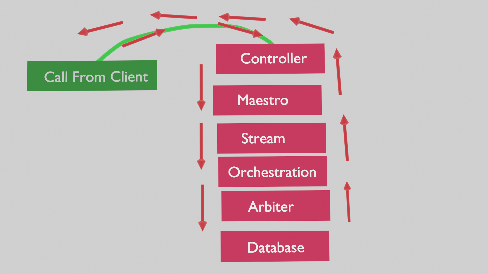

##### Service Side Backend Agents

When running in an multi-agent environment, the idea is to run multiple front-end webservers(red). Whenever they receive a command that will create, update or delete, it will write a message to the [datalake](#Datalake), and send a message to the background agent(green). The background agent will execute that command, and return the result.

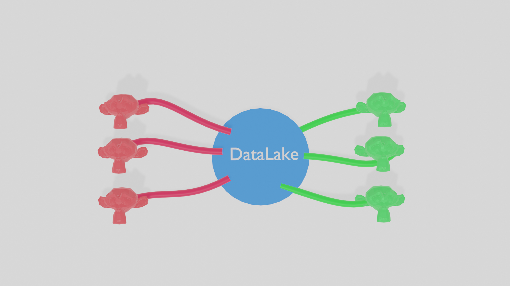

Distributing comands to random agents wouldn't help achieve the goal of eliminating two tasks operating on the same model instance. Using a scheme that relies on the model instance Id to distribute the commands has been devised. The agents will self organize so that, each agent will only operate on a subset of model types with certain Ids. This document wil. explain how that works in [another section](#markdown-header-agent-self-organization)


### Scaling Resources
Considerations for scaling resources to handle large amounts of data starts from the model. The goal of this model is not for maximizing the speed of an individual transaction, but maximizing the amount of transactions that can take place. Since devops is a lifestyle, we want to enable ourselves to turn up and down the number of agent instances running at any moment. In order to achieve this, agents have to be self organizing to maintain the flow integrity requirement of the system.  Flow integrity, in this context, meaning that an instance of a model will never be worked on my two different agent instances.

### Background Agents
Background agents process events in bulk to handle a large influx of messages, and maintain flow integrity.

### Agent Self Organization

In the current iteration, a webhost running a long running background task RedSimpleAgentCenter organizes and coordinates the agents. As new background agents come online, they message the RedSimpleAgentCenter. Then they will be told their assignment and when they can begin processing.

1. RedSimpleAgentCenter workflow
    1. RedSimpleAgentCenter starts.
    1. RedSimpleAgentCenter waits for worker instance to call.
    1. RedSimpleAgentCenter will notify the worker of its workload, and when it can start.
    1. When a background agent shuts down, it informs other agents of change and to stop processing.
    1. Re-calculate workloads and restart worker instances.

1. Background agent workflow(RedSelfOrganizingService)
    1. Call the simple agent center.
    1. Receive workload.
    1. Receive notification of ready state.
    1. Periodically refresh state with the RedSimpleAgentCenter.
    1. When shutting down, notify RedSimpleAgentCenter of shutdown.

Calculating the workload is based on the stream type, model type and model Id. Stream types are application specific concepts, and allow the application to distribute more work to certain kinds of tasks then others. If you have a long running background task related to a specific set of models, increasing the number of instances that will process those situations is hopefully straightforword.

- Example Stream Types
    - Long Running
    - Short Running
- Example Model Types
    - School
    - District

If the applications only relied on the stream and model types to distribute the workload, it wouldn't be able to distribute the work to a lot of clients and maintain the model instance race condition ban. Using the Id of the model being updated or deleted we can distribute to instances of agents using the first few characters of an Id to determine the agent which will process the command.

For Example, Agent 2 may be assigned to handle the School models that have ids that start with 0, 1, 2 or 3. If the Id of the model instance is the following, it would be handled by Agent 2. Agent 3 wouldn't ever look at this model, unless the work is redistributed and it became apart of Agent 3's workload.

```
var Id = "087075e5-a794-45b0-94b5-6280ec958eaf";
```
When creating a new instance of a model, a guid key can be generated to determine which Agent would process the new command. There are probably an enumerable number of possible distribution models possible for this situation, but this is the current choice for RedQuickBuilder functionality.


#### What are Worker Groups
The background agents can be divided into groups for putting resources where they need to be. Since that is highly dependent on the applications needs. This is configured with an implementation of the IWorkTaskService interface. RedQuickBuilder will make an implementation for each application automatically, but it is recommended to tailor it to the applications needs.

#### Setting up Worker Groups

```csharp
    public class ImplementingWorkTaskService: IWorkTaskService { 
        public IList<WorkerGroup> BuildWorkerGroups(IList<WorkerMinister> ministers/*The agents that are running*/)
        {
            var result = new List<WorkerGroup>();
            
            // Divide the agents into the desired sets.
            var minister_defaults = ministers.Take(2).ToList();
            var workGroupsONly = ministers.Skip(2).Take(2).ToList();
            var left_over_ministers = ministers.Skip(4).ToList();
            
            // Define a group that will only will process stream types equal to item1.
            result.Add(WorkerGroup.BuildStreamTypeOnly(minister_defaults, new List<string> { "item1" }));
            
            // Define a group that will only will process work task types equal to task2.
            result.Add(WorkerGroup.BuildWorkTaskOnly(workGroupsONly, new List<string> { "task2" }));
            
            // Defines a groupd that will process the rest.
            var workGroup = WorkerGroup.BuildDefault(left_over_ministers);
            
            result.Add(workGroup);
            return result;
        }

        public IList<string> GetWorkTasks() { 
            throw new NotImplementedException();
        }

        public string GetWorkTaskFor(string streamType, string agentType, string changeType, string functionName) { 
            throw new NotImplementedException();
        }
    }
```

### Web Service
##### Controllers 
- Are the same controllers that exist in most .net core web api based applications.
- Why use an API
    - Multiple UIs can use the same UI, instead of generating html or whatever for the client side to render.
- Controllers Do
    - Authentication
        - Bearer Tokens 
    - Authorization
        - Business rules guide who can do what and when
    - Execution
        - Executing the logic 
        - Eliminating Race conditions
    
##### Filtering
    - Filtering based on business rules

##### Views
    - Building basic UIs

##### Language
    - Building a title service to deliver content in the language of choice.

##### Scaling
    - Scaling the processing of commands, without losing the ability to guarentee no model is manipulated twice by the same.

## Graph
To help illustrate the graph, I am going to invent a scenario that we can use to describe the following sections. This is going to be a school application that does "school things". Since, I'm assuming most people are familar with the concept, hopefully this helps more than it hurts.

- The RedQuickBuilder graph is the document that describes the application in terms of nodes and links.
- Nodes
    - Nodes have properties that describe the node. There are lots of potential properties, and the majority are used for specific purposes depending on context.
    - Required Properties
        - NodeTypes
- Links
    - Links describe relationships between nodes using properties attached to the link. 
    - Generally links have types, and properties that may describe specific relationships.
        - Example: A Model node references Property node with a link with the link type 'property-link'.
		
### Models
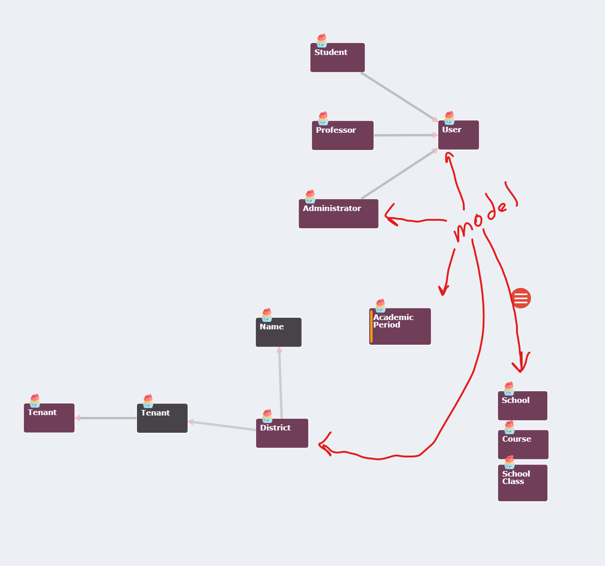
The models in this graph are representing concepts that will appear in the applications.
For Example: School will represent a school which in our case means a building or virtual building that organizes groups of people, courses and classes.

#### School models
- Tenants 
    - Tenants represent clients that may purchase access to this system to do "school things". 
- Districts
    - Collections of schools form districts.
- Schools 
    - Collection of classes that for schools
- Course
    - Is a representation of a type of class.
        - Algebra is a course, but Mrs What professors a school class of Algebra.
- School Class
    - Is a collection of professors and students
- Student
    - Is a person who can participate as a learner in a class.
- Professor
    - Is a person that professors students.
- Administrator
    - Is a person who administrates a district, school, class, students, professors and other administrator.
- Academic Period
    - Represents a period time, e.g. School Year or Grading Period
- User
    - Is a person that can operate as a Student Professor or Administrator

#### Programatic details about models
- Models encapsulate concepts that are pertinent to the application.
    - Models may be related to the functionality of the application or the operation of the application.
        - Operation
            - Models may describe User objects or other concepts used for logging in.
    - Models can be Agents, Users or neither.
        - Users are the actual accounts used by the system for logging in.
            - Users may have multiple agents, and therefore can perform different actions based on their roles, and possible see more of less data in their UIs.
        - Agents are personas that users may use to execute functionality with in the application.
            - Example:
                - A 'Customer' may be an Agent which performs operations on behalf of the User.
    -	Models have properties.
        - There are default properties which will exist on every model, but don't necessarily appear in the RedQuickBuilder UI.
        - Default Properties
            - Owner
            - Updated
            - Id
            - Created
            - Deleted
            - Version
        - The default properties will afford the system assumptions that can be made to implement features such as:
            - constrained concurrency
                - Guarenteeing that no race conditions can occur with a unique model instance.
            - model versioning
                - Reconciliation
            - un-deletion.
    - Referencing other models
        - Models can reference other models by describing them as logical children.
            - References are kept on the referenced model type as a string property with the Id of the model on a property named as the Model's name.
                - Example.
                    - School has a child of ClassRoom, then ClassRoom has a property called School.
            - If the model needs to encapsulate a Many to Many relationship, an intermediate Model can hold the references to the Models it is connecting. This also give an opportunity to keep more data describing the relationship on the intermediate model.

### Properties

- Properties give models meaning. They have types which can be simple, like int, string, DateTime or they can be complex reference types.
- Models are almost always connected to properties.
- Attributes that are connected to properties, give clues to the expectations of the property.
    - Example: An attribute with an Email type, suggests that the property will have to have a string with a valid email address.
    - Attributes effects can be seen in the client and server side of the applications. The validation sections of the applications will generate code that enforce these attributes. The client side of the application will also attempt to enforce the rules descibed by the attributes.
    - There are no limits to the number of attributes that can be applied to a property, but if they attributes contradict the type of property, build or runtime errors may occur.

### Attributes
- Attributes are usefull because they can impart meaning or expectations to a property. These expectations can be used to defined validations for functions.

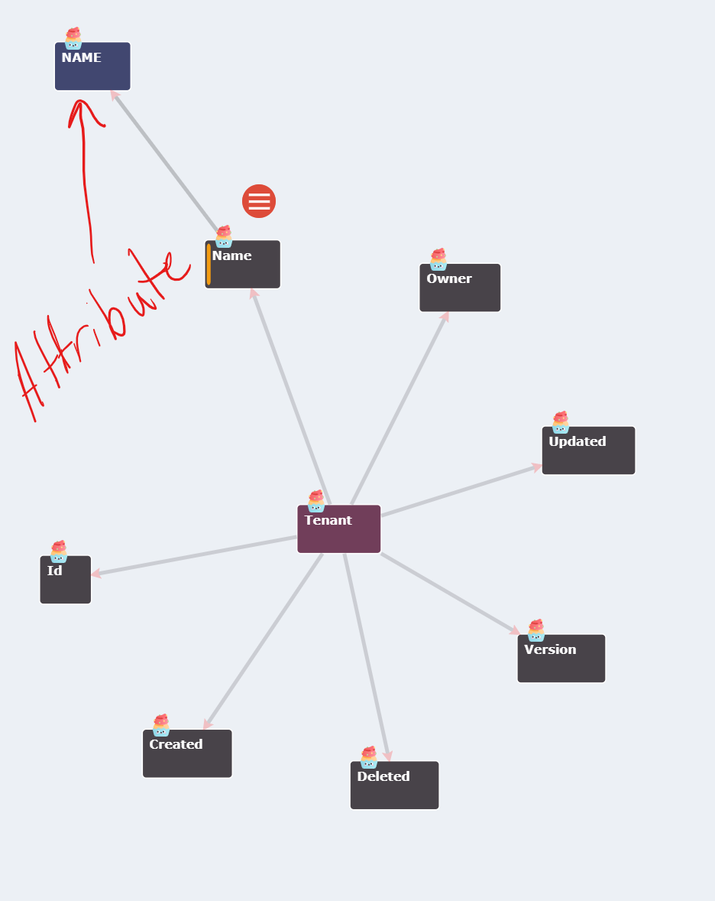

### Agents
Agents are special types of Models. They represent personas/actors who can view, create, update or delete data from the system. Technically the 'User' is also an actor, but is only being used in the intialization of "Agents".
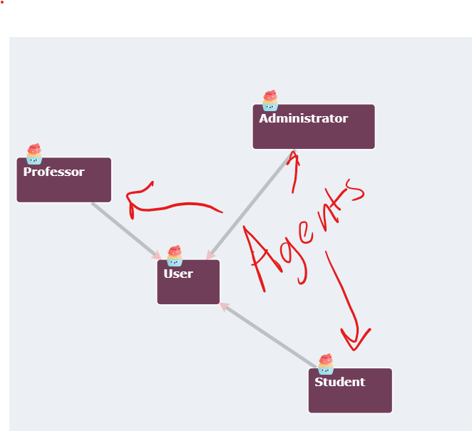


#### Contrived example
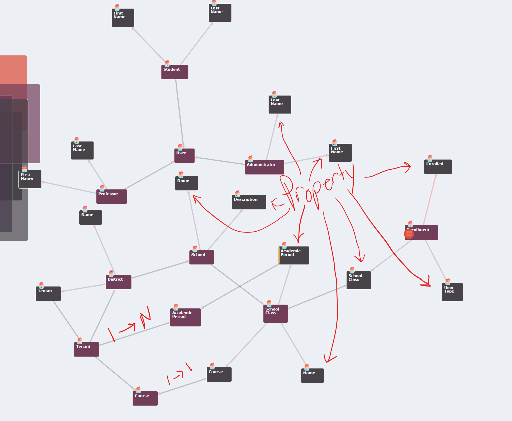

Continuing with the school app concept. The models now have properties attached. Not all the possible properties that could exist in a real school application, but enough to illustrate some relationships.

- 1 to N
    - The relationship between the Tenant and the Academic Period is 1 to many. The Tenant can have many academic periods, because we can assume a customer would operate over different years, or break school years up in to quarters, semesters or tri-mesters. So, we can encode the relationship with a link between them. In the menu, we define a relationship between the academic period as a logical child, which will add a link between those two nodes. The link itself will carry the information describing the relationship between the nodes.
    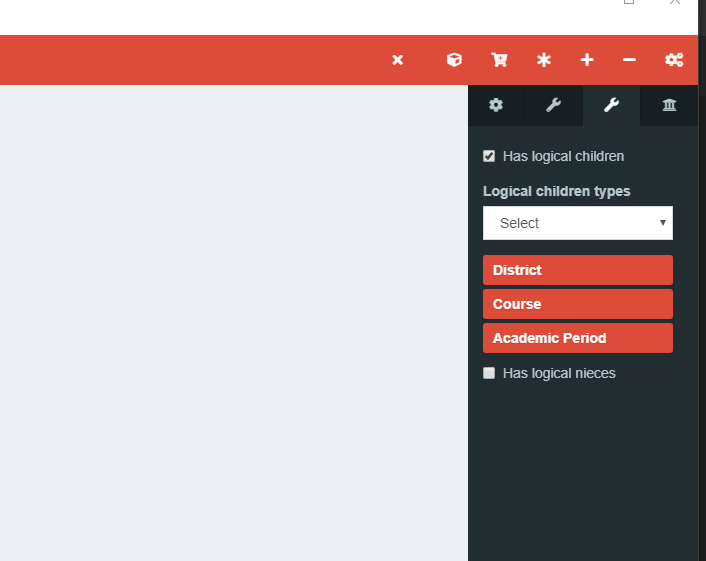
- 1 to 1
    - The Course Node(black) and the Course Node(purple) demonstrates a 1 to 1 relationship. The black node is the property, and the purple node is the Model. The link between them encapsulates the idea that the Course property on the School Class model may 'point' to a Course model instance.
- Model to Property
    - The majority of other arrows between black nodes and purple nodes represent a simple "model - property" relationship.

Since we have models and properties, we have enough to start generating a bit of code. This is what is generated for the Tenant Model based on the graph. There are a bunch of RedQuick libraries that are used, which RedQuickBuilder uses a lot, but they will be explained later. Also, I wish I could say the code comes out formatted like this but it doesn't. Basically, the tabbing isn't perfect, it isn't horrible just looks like a drunk person typed it. You many notice that there are a bunch of functions in the class that no one has described. Don't worry, they are there for a reason which will be explained later. 

The big thing to notice, is that the relationships described in the graph are implemented. There are properties implemented that correspond to the relationship captured in the graph. One could definitely make the solid argument that lists like this could grow far too large, and destroy performance. That would be true. So, an alternative would be to create a property on the other model to reference the Tenant, in that case. So the District would have a property in its generated class that referenced the Tenant as an example.

```csharp
using RedQuickCore.Identity;
using RedQuick.Data;
using RedQuick.Attributes;
using RedQuick.Interfaces;
using RedQuick.Validation;
using RedQuickCore.Validation.Rules;
using RedQuickCore.Data;
using RedQuick.Interfaces.Arbiter;
using RedQuick.Configuration;
using RedQuick.Util;
using RedQuick.Interfaces.Data;
using RedQuick.UI;
using System;
using System.Collections;
using System.Collections.Generic;
using System.Linq;
using System.Net;
using System.Net.Http;
using System.Threading.Tasks;

namespace Baroque.Models 
{
    [Red]
    public class Tenant : DBaseData
    {

        public static Tenant Create()
        {
            return new Tenant { };
        }

        public static Tenant Strip(Tenant model)
        {
            var new_model = Create();
            new_model.Id = model?.Id;
            return new_model;
        }

        public static Tenant Merge(Tenant a, Tenant b)
        {
            var model = Create();
            if(a.District == null || a.District.Count == 0) {
                model.District = b.District;
            }
            if(a.Course == null || a.Course.Count == 0) {
                model.Course = b.Course;
            }
            if(a.AcademicPeriod == null || a.AcademicPeriod.Count == 0) {
                model.AcademicPeriod = b.AcademicPeriod;
            }

            return model;
        }

        public static IList<Tenant> Merge(IList<Tenant> a, IList<Tenant> b)
        {
           var result = new List<Tenant>();
           if(a != null)
           {
              foreach(var a_i in a) {
                result.Add(a_i);
              }
           }
           if(b != null)
           {
              foreach(var b_i in b)
              {
                var match = result.FirstOrDefault(x=> x.Id == b_i.Id);
                if(match != null)
                {
                    var merged_item = Merge(match, b_i);
                    result = result.Where(x=> x.Id != b_i.Id).ToList();
                    result.Add(merged_item);
                }
                else {
                  result.Add(b_i);
                }
              }
           }
           return result;
        }

        public static Tenant  GetDefaultModel() {
            var result = Create();
            return result;
        }
        public IList<string> District { get; set; }

        public IList<string> Course { get; set; }

        public IList<string> AcademicPeriod { get; set; }

    }

}
```

## Building Functionality

In the current contrived example, Models and Agents have been defined but there is no functionality described. So, a user may login to the system but the user can't do anything. Which would make it a pretty useless application. So, the next step is defining the business logic of the system.

## RedQuickBuilder Application

### Agent Access
- Purpose
    - Describes how screens will be generated
    - Describes which Agents can access screens.
    - Describes functions for loading screens,
    - Describes actions that can occur on the screens.
- Dashboard Screens
    - Dashboard screens are meant as screens that direct "traffic" from on form to the next. At least at the time of this writing.
- Agent Screens
		- Agent screen are meant for forms that the Agents can use to Update, Create or View Data.     

### Adding Functionality

To setup the functionality we leave the graph, and go to the Agent Access screen.

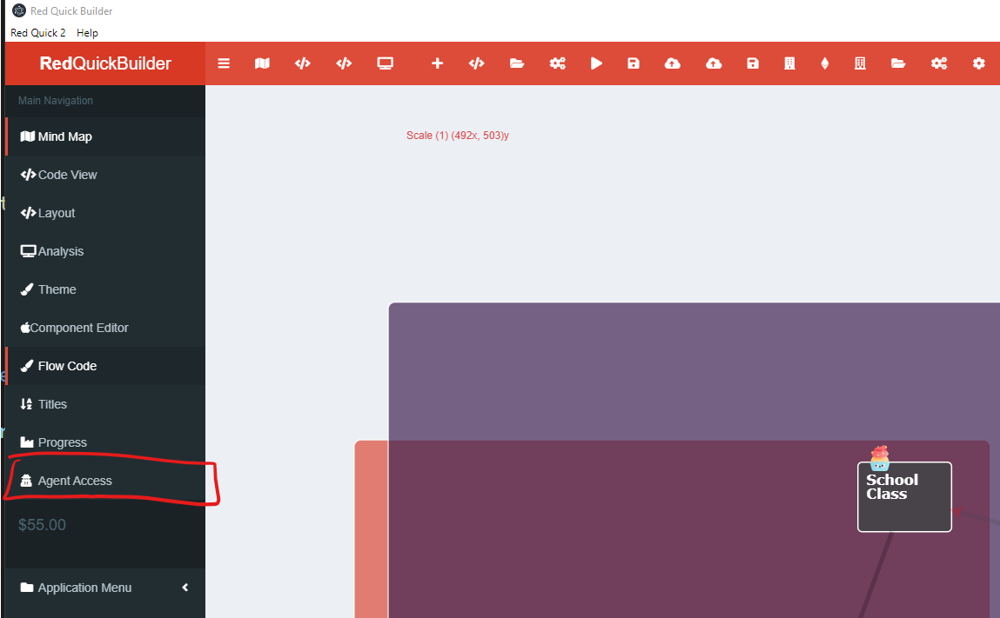

Then we will see a "Load Agent" button. Which will pull the current state into this screen, and make it possible to add functionality

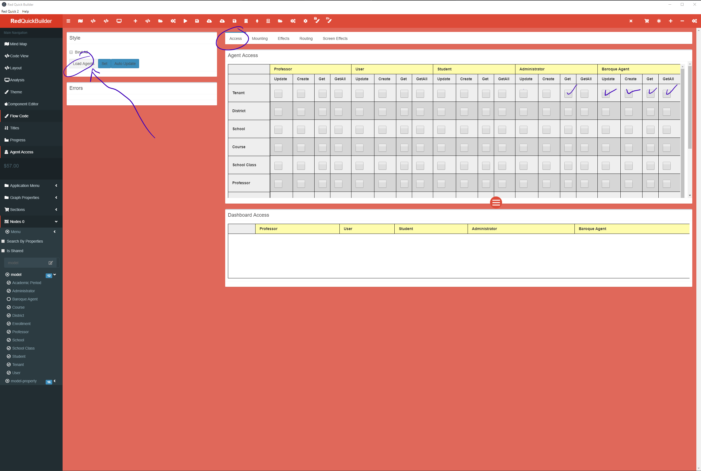
#### Screen Types

- Get
    - Displays a single model instance.
- GetAll
    - Displays a list of model instances 
- Create
    - A form screen used to create an model instance.
- Update
    - A form screen user to update an existing model instance.

#### Adding Access
The first step is adding access to screens. The grid represents which screens an "Agent" can access. So the top column header lists the Agent type and the Screen type, and the row header lists the model which will be interacted with. In the image above, the check box under Administrator Get on the Tenant row means that a user with an Administrator persona can look at a 'Get' page of a Tenant.

Eagle eyes will see that a 'Baroque Agent' can update, create and view tenants. Baroque Agents are basically the imaginary 'Baroque' companies employees who are managing their school district customers/tenants. They were added to this contrived example, because I forgot to do it earlier. But that illustrates the idea that any idea that can be implemented can be changed.

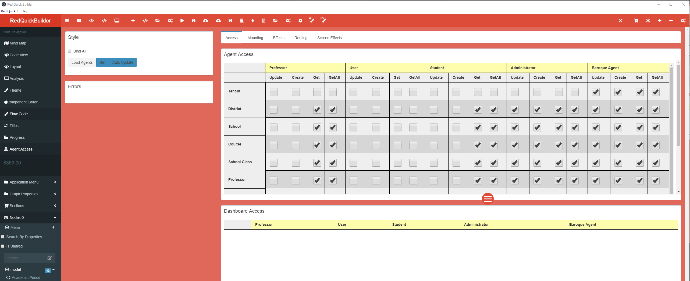

I filled in a bunch of checkboxes, which will define what screens are possible for a professor, student, administrator and baroque users to see. This doesn't need to mean that absolutely all the functionality is available for every professor on every professor screen. It only means that it is possible for a professor to navigate to that screen.

#### Mounting

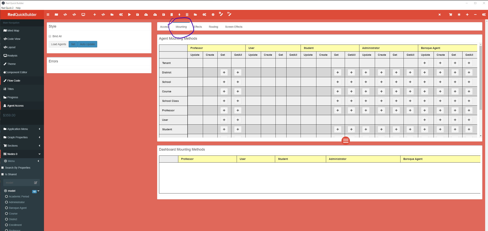
In the mounting screen, all the screens that have the possibility of existing have buttons which will bring up a menu to define the mounting functions. Mounting functions are the functions that are executed after arriving on the screen. In a Create page, that may mean loading a default model for the create form. On a Get screen, that may mean the data that will be displayed for the instance of the model for that particular user.

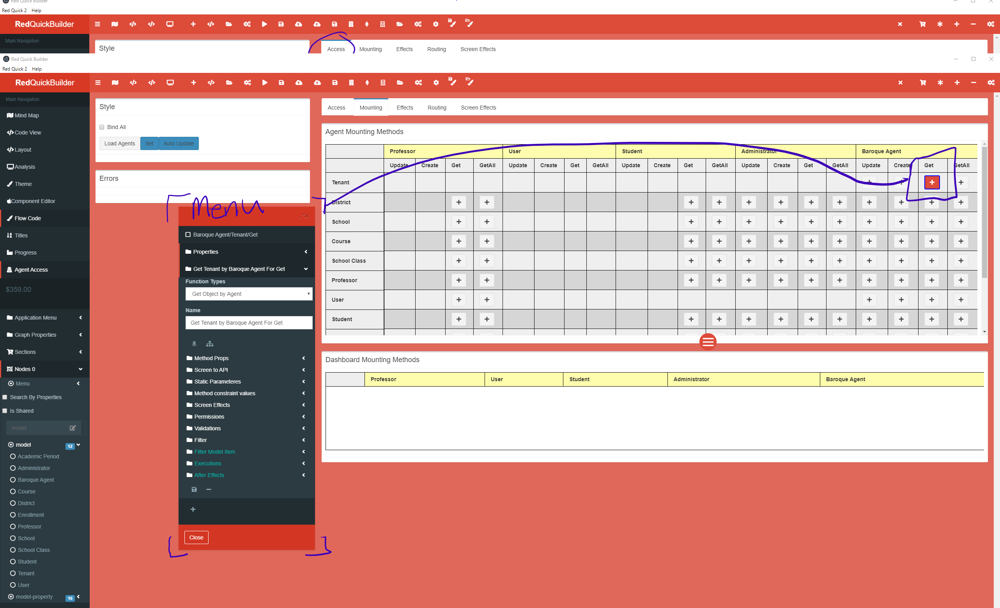


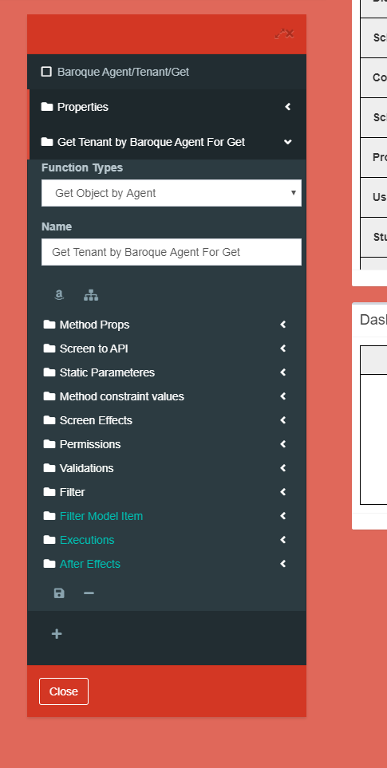
##### Function theory
Contructing a function with this menu should be very easy, but it maybe a bit intimidating without understanding the why. One of the main ideas behind this app is that most "business" applications are formulaic and repetitive when done correctly. Even in a complex process there are only a few unique situations that arise, but the combination of those situations can make code complex if not managed.

##### Choosing a Function type
In the menu, the first choice to be made is the what type of function is desired. It may be a bold claim that there are only 13 types of functions required to build an application, and I'm probably wrong. But at this point in time, I don't have any more than that. When/if I need more, I will just add them.

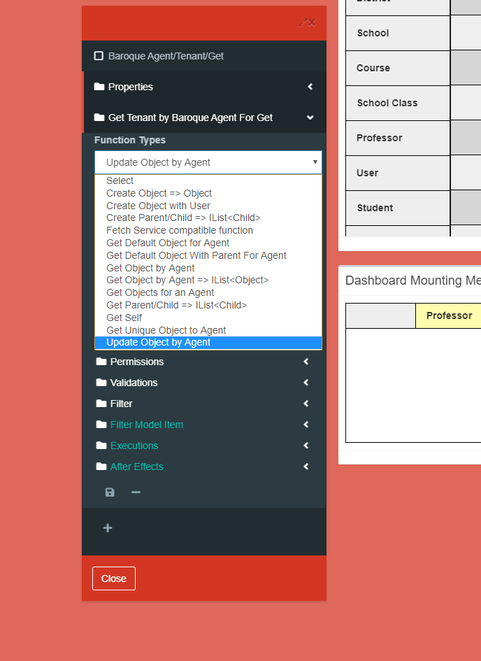

##### Function constraints 

The function constraints are defining which agent and model(s) are used in the function. Usually this is automatically filled in, and it is usually undesireable to change. In this illustrated case, the model_output is a Tenant, and that is the expected output of the function. When the api call is made on behalf of the user, it will use the Baroque Agent's persona to execute the function.

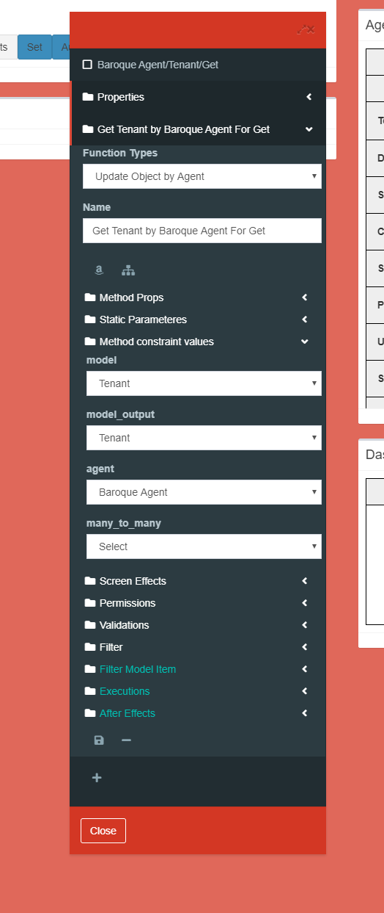

##### Function permissions

One of the most important things about any system is security, and one of the ways to manage that is through permissions. Permissions are added in the permission section of the menu. In the example below, it is using a plain text system to generate the rules that will transform in to documentation and into C# code. The hope is that the simplicity of the sentences allows for a developer to create the business rules required to meet the requirements.

- The agent's deleted property is false
    - This is saying the the Baroque User's deleted property must equal false in order to execute this function.

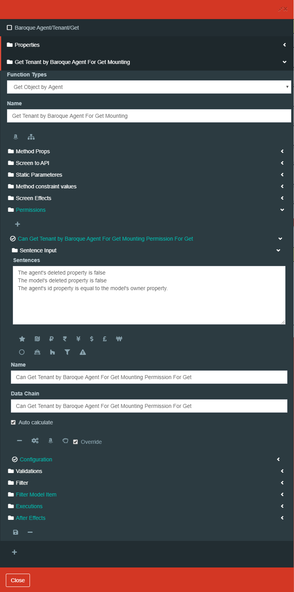

For the sake of speed and efficiency the names of the functions are generated using the contextual properties and values. Some names leave a lot to be desired, but the pattern will be clear in what they do and mean.

You may be curious about what the code looks like. Just like before, the code has been formatted so that it is more legible. But, this is the implementation of the permission code for the function. There is plenty of properties that could be deleted from the class cause they aren't being used, but it is easier to generate code with extras than trimming out all the unnecessary parts.

- [IRedArbiter](#IRedArbiter) 

```csharp
public class CanGetTenantbyBaroqueAgentForGetMountingPermissionForGet
{
    // d334aa78-bb68-4a44-afd0-bfcb76536df8
    IRedArbiter<Tenant> arbiterTenant;
    IRedArbiter<BaroqueAgent> arbiterBaroqueAgent;
    static IRedArbiter<Tenant> arbiterTenantStatic {
        get {
            if(arbiterTenantStatic == null) {
                _arbiterTenantStatic = RedStrapper.Resolve<IRedArbiter<Tenant>>();
            }
            return _arbiterTenantStatic;
        }
    }
    static IRedArbiter<BaroqueAgent> arbiterBaroqueAgentStatic {
        get {
            if(arbiterBaroqueAgentStatic == null) {
                _arbiterBaroqueAgentStatic = RedStrapper.Resolve<IRedArbiter<BaroqueAgent>>();
            }
            return _arbiterBaroqueAgentStatic;
        }
    }

    static IRedArbiter<Tenant> _arbiterTenantStatic;
    static IRedArbiter<BaroqueAgent> _arbiterBaroqueAgentStatic;

    public CanGetTenantbyBaroqueAgentForGetMountingPermissionForGet(
        IRedArbiter<Tenant> _arbiterTenant, 
        IRedArbiter<BaroqueAgent> _arbiterBaroqueAgent) {
        arbiterTenant = _arbiterTenant;
        arbiterBaroqueAgent = _arbiterBaroqueAgent;
    }

    public static async Task<bool> Execute(Tenant model = null, BaroqueAgent agent = null)
    {

        Func<Task<bool>> func = async () => {
            // build model value here.
            var test_0 = !agent.Deleted;
            var test_1 = test_0 && !model.Deleted;
            var test_2 = test_1 && agent.Id == model.Owner;
            if(!test_2) {
                return false;
            }

            return true;
        };

        return await func();
    }

}
```

##### Function filtering

Filtering the output of a function is important, and being able to filter what properties are coming out of the api is also. Filtering allows the models to be trimmed down to what each type of user should see out of the web api. The filtering can even filter based on some rules that can be implemented within the menu. 

So, if a Baroque Users are restricted from seeing certain properties based on a status or security designation then that can be implemented with the menu.

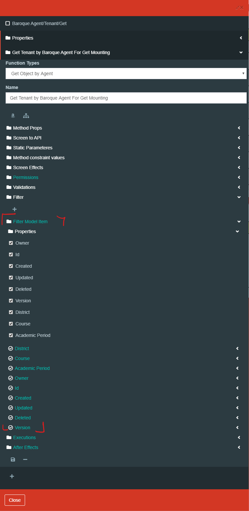
##### Mounting conclusion

Typically for a mounting function, a model instance is retrieved or a default model is generated for the UI. There are more things that can be added to this function, but they are typically reserved for "Effects".
#### Effects
Effects are functions that "effect" the systems state. For Example, when a model instance is created and stored in a database, the api endpoint is an effect. So just as mounting functions are defined in a grid, effects are also built in almost the same way.

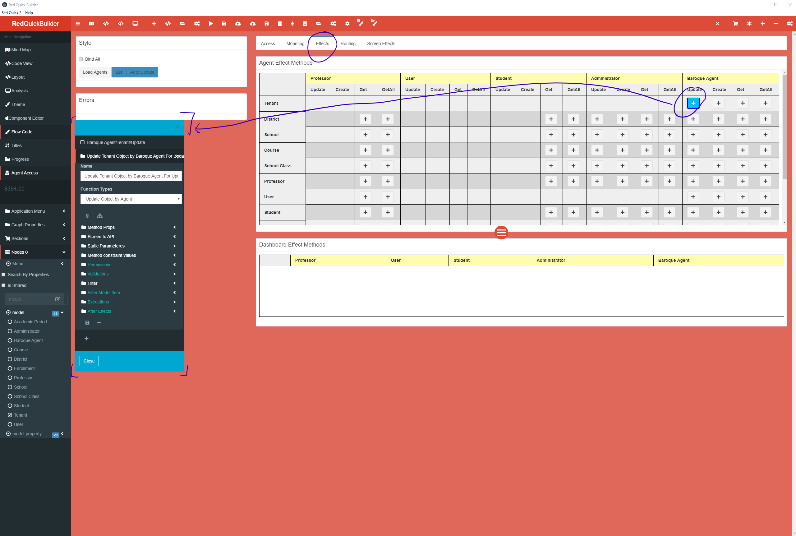

Just like the Mounting functions, effects are built in the same way. There are a few other features that are more likely to be used while creating an effect, like Validations, Executions and After Effects.

#### Validations

Validations, like [Permissions](#Permissions), can use the simple text input to describe the validations that should be applied to the model. The simple text inputs will also generate documentation as well as c# code to implement the validation.

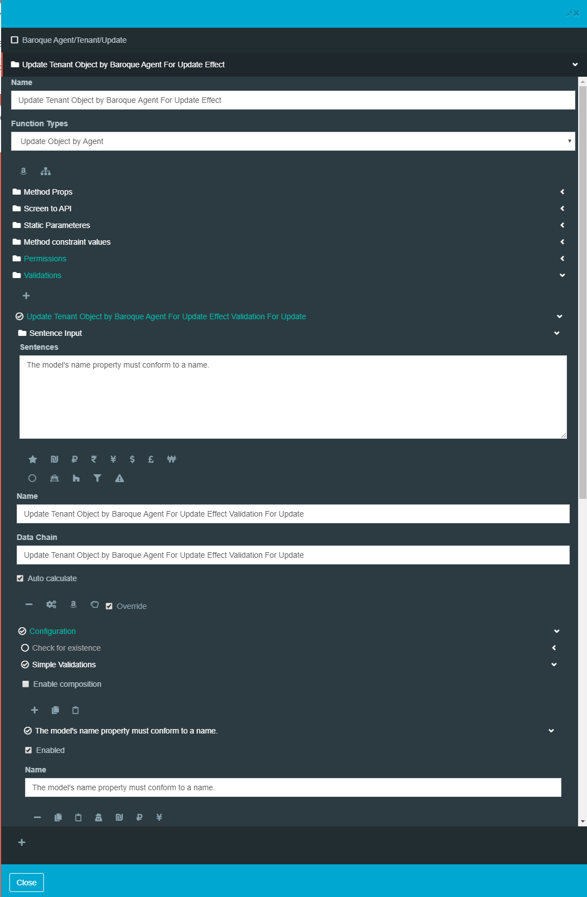

The circled button will generate a list of text that implements all the assumptions added to the model's properties. In this case, an attribute was connected to the Name property that defines it as a name. So, it can generate a list of these assumptions and put them in the simple text input.

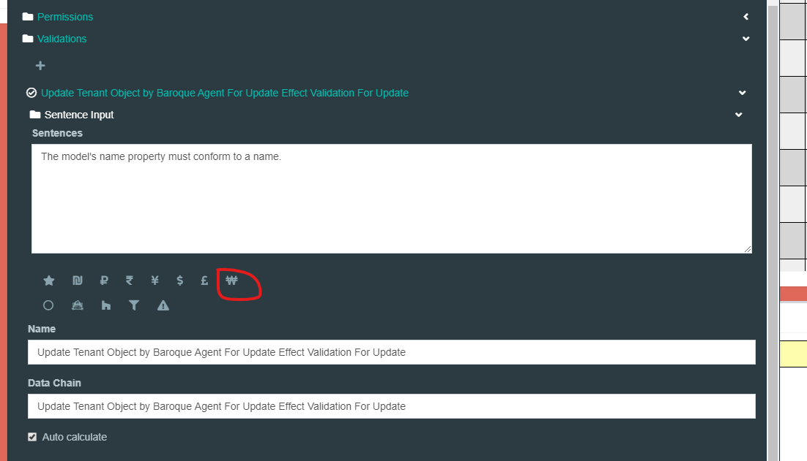

The simple text input will generate a configuration that will turn into code. Since, it is a configuration then it can be customized to work as desired. 

In this case, "The model's name property must conform to a name", translates into a configuration which says that the name property can't be null, and the minimum length of the name is 1 character long, and the maximum length of a name is 100 characters.


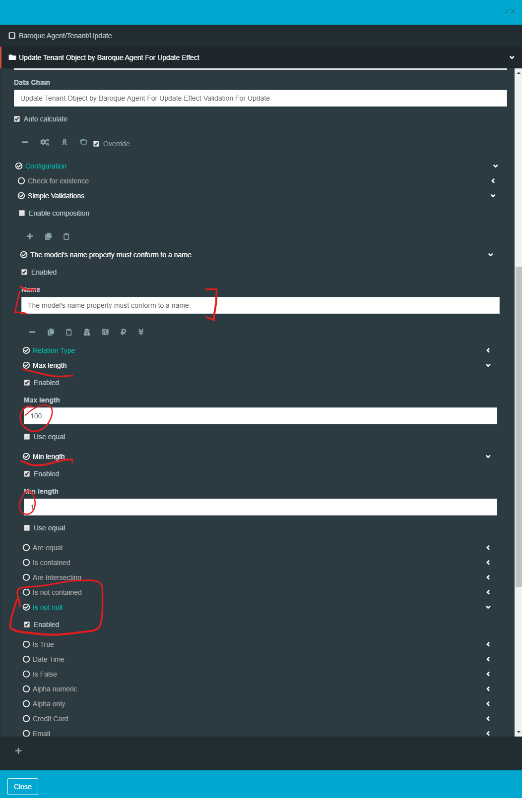
#### Executions
Executions, like [Permissions](#Permissions), can use simple text input to describe the execution steps that should be applied to the model. As before, documentation is generated at the same time.

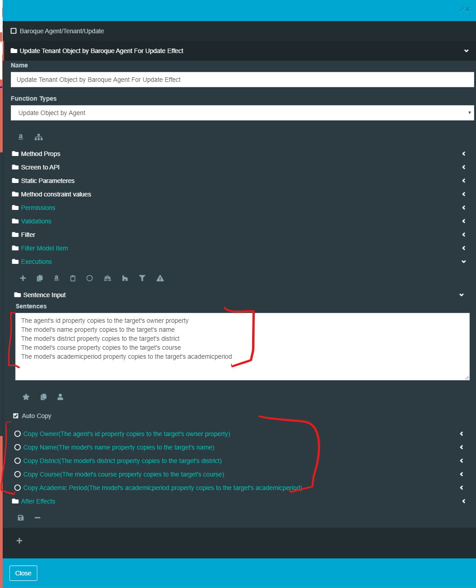

Just as before effects have their own configurations that can be customized for the needs of the application. If 
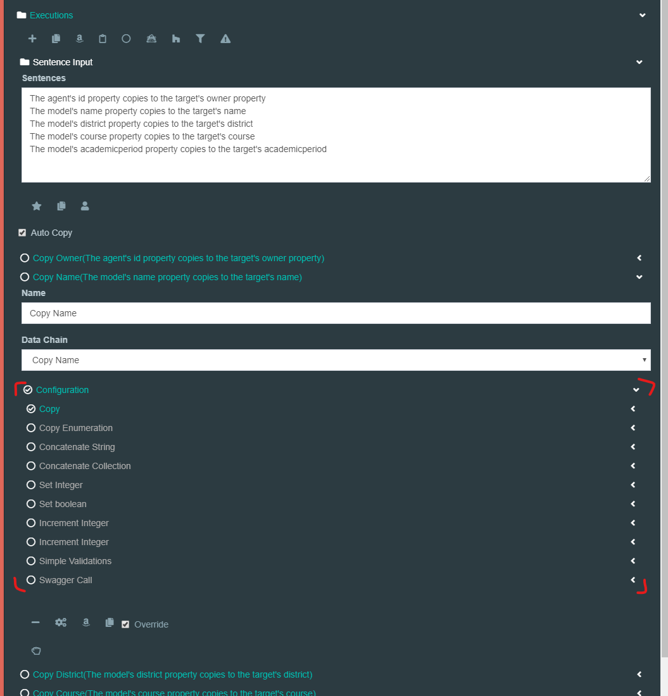

#### After Effects

Executing simple CRUD functions is very useful, but doesn't make building complex work flows inside the UI easy or possible. That is where After Effects show their power. An after effect chains a function to another. So, after a function completes it will execute the list of after effects. 

Following the same pattern as Validation, a simple text entry can be used to describe the functions to be executed. The text is parsed, and used to generate the configuration which will eventually turn into c# code.

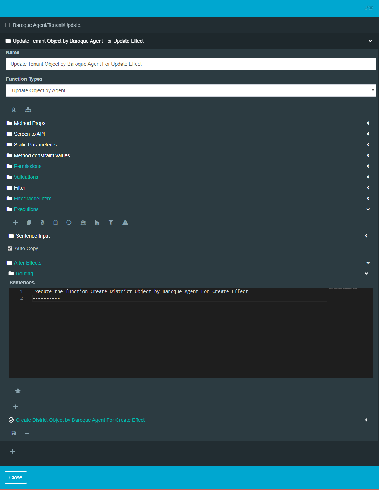

##### After Effects scripting

TBD
#### Routing

Navigating between screens is paramount to any application. Setting up navigation is really easy with the Routing screen.

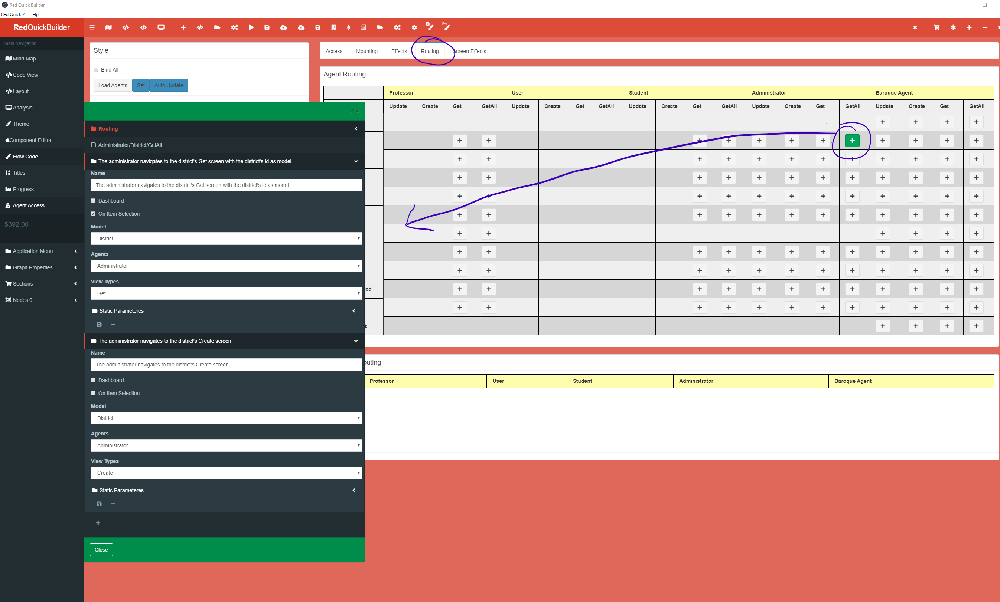;

Describing the routes with sentences is optional. The sentences will be translated into the configuration that is shown below. 

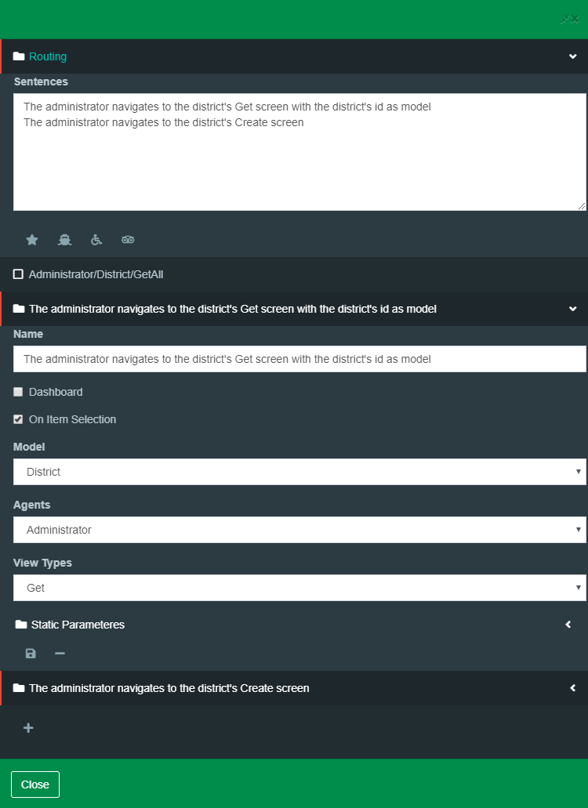;
In the example above, the administrator navigates from the District's GetAll screen to the District's Get screen. Also, the administrator navigates to the create screen. Each of these statements will generate a button in the client UI that will implement the actual navigation.

#### Screen Effects
Screen effects are used to add properties to the local state in the Client UI. Then those properties are available to apply to components or styles in the ui.
In the following window, the property that will be generated is **showsomething**, and the [datachain](#DataChains) that will generate the function is **Get Should Show**.

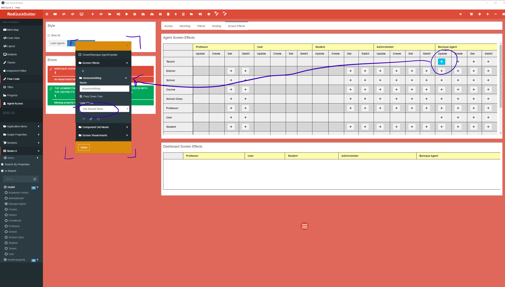

In the Client UI code:
```tsx
export default class SomeComponent extends Component<any, any> {
	constructor(props: any) {
		super(props);
		this.state = {
            showsomething: null
        };
    }
    componentDidUpdate(prevProps: any) {
        this.captureValues();
    }
    componentDidMount() {
        this.captureValues();
    }
    captureValues() {
        let updated = false;
        let updates = {};


        var new_showsomething =  DC.GetShouldShow(/* arguments */);
        if (new_showsomething !== this.state.showsomething) {
            updated = true;
            updates = { ...updates, showsomething: new_showsomething };
        }

        if (updated) {
            this.setState(() => {
                return updates;
            })
        }
    }
}
```
#### Screen Inserts

Screen inserts are snippets that will be injected into a screen. So, any custom UI elements that maybe difficult to construct with the regurlar layout engine can be added here. Shared screen snippets can be created in the graph and referenced to eliminate duplicate code snippets is possible.

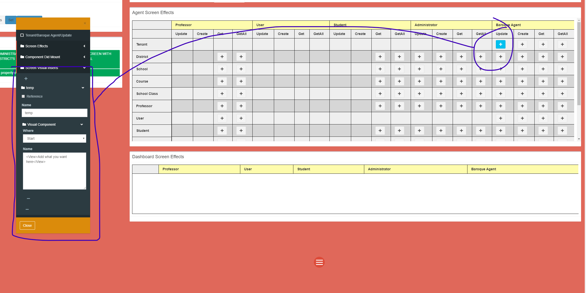

In the snippet below, the places where the snippets would be injected are marked.

```tsx
<div className={`get-quote-screen-io  main-screen  `} >
    <!-- Start snippets added here  -->
    <div className={`  main-screen-container  `} >
        <div className={`  MainHeader  `} >
        <GetTitle
            label={titleService.get(`Title`)} />
        </div>
        <div className={`  MainMenu  `} >
        <GetMenu
            label={titleService.get(`Menu`)}
            value={GetMenuDataSource(GetMenuSource, RedGraph)}
        />
        </div>
        <div className={`  MainSection  `} >
        <GetComponent
            label={titleService.get(`Component`)} />
        </div>
    </div>
    <!-- End snippets added here  -->
</div>
```


### Title System
- Internationalization is a 1st class consideration in RedQuickBuilder. All text that is presented to the user, should be translated for end-users. Its very expensive to think about languages/cultures half way through the life-cycle of the applications, so we take care of it up front. Even if one language is used, just having the framwork setup for multiple languages lowers the effort immensely.
- Currently, RedQuickBuilder is capable of adding translations in:
    - English
    - French
    - Norwegian
    - German
- 


## RedQuick

RedQuick is a library that is heavily relied upon by RedQuickBuilder. 

- RedQuick implements
    - easy to use CRUD functionality
    - Identity based on [Microsoft.AspNetCore.Identity](https://docs.microsoft.com/en-us/aspnet/core/security/authentication/identity?view=aspnetcore-5.0&tabs=visual-studio)
    - Background Task
        - Distributing workload across managed agents.

### IRedArbiter

IRedArbiter is the work horse of RedQuick. It is an interface that provides the CRUD functions for all the models that will exist in an application generated in RedQuickBuilder. Every model in the application will implement the **IDBaseData** interface. That gives the system all the information it needs to distribute work to many background agents. Update the versions of models so that front ends can know which version of the model is the latest without relying on comparing dates.

```csharp
    public interface IRedArbiter<T> where T : IDBaseData
    {
        Task<T> Create(T obj);
        Task<T> GetUnique<T>(Func<T, bool> p);
        Task<T> Get<T>(string id);
        Task<IList<T>> GetAll<T>();
        Task<bool> Delete(string id);
        Task<bool> Delete(T id);
        Task<T> Update(T obj);

        Task<IList<O>> GetOwnedBy<O>(string id, Func<int> skip = null, Func<int> take = null, Func<O, float> orderBy = null)
            where O : IDBaseData, IOwned;

        Task<IList<V>> GetMachineOwnedBy<V>(string id, Func<int> skip = null, Func<int> take = null, Func<V, float> orderBy = null)
            where V : IDBaseData, IRedMachineOwned;

        Task<IList<T>> GetBy(Func<T, bool> p, Func<int> skip = null, Func<int> take = null, Func<T, float> orderBy = null);
        Task<IList<T>> Query(Expression<Func<T, bool>> func, Func<int> skip = null, Func<int> take = null, Func<T, float> orderBy = null);
    }
```

```csharp
  public interface IDBaseData
    {
        string Id { get; set; }

        DateTime Updated { get; set; }

        DateTime Created { get; set; }

        int Version { get; set; }
        bool Deleted { get; set; }

        string redtype { get; set; }

    }
```

# Definitions

## Datalake

A centralized data storage unit. Or a big ol' DB.

## DataChains

Datachains are functionality snippets that can be used to create complex functions. The idea is that you can change them together to build up more complex workflows. But, in practice they are bite sized pieces of code that implement small logical pieces.